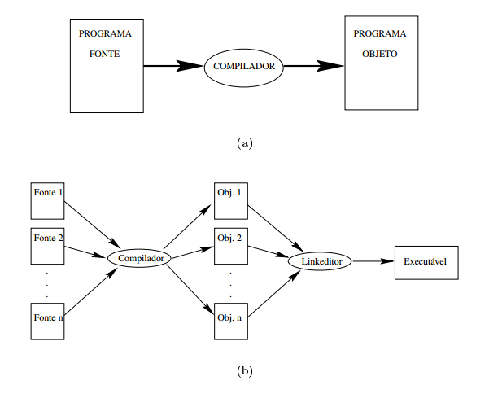
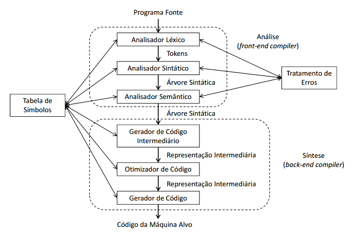

Introdução e visão geral sobre compiladores
======

A construção de compiladores abrange diversas áreas de estudo na área de ciências da computação como por exemplo conceitos de linguagens de programação, arquitetura de máquina, algoritmos e engenharia de software. Nesse *ebook* será apresentado uma introdução ao processo de compilação mostrando uma visão de alto nível da estrutura de um compilador. As linguagens de programação e a arquitetura de computadores evoluem e estão cada vez mais sofisticados, o desafio dos projetistas de compiladores é criar algoritmos mais eficientes que visam obter um melhor desempenho no uso de memória e processamento.

O estudo de compiladores é essencial para entender a ligação entre engenharia de software, linguagem de programação, sistemas operacionais e arquitetura de computadores. Nessa primeira parte do *ebook*, vamos apresentar as etapas envolvidas no processo de compilação e como ela se relaciona com uma linguagem de programação.

### O Compilador

O compilador é um software complexo que converte uma linguagem fonte, ou origem, em uma linguagem destino, ou seja, converte um programa originado de uma linguagem de programação para uma linguagem que possa ser entendida e executada por um computador, esse etapa preserva a significado do programa fonte original. Durante a compilação são executadas tarefas que geram uma descrição de linguagem em outra.

Existem dois princípios fundamentais na construção de compiladores:

1. O compilador deve preservar o significado do programa a ser compilado.

2. O compilador deve melhorar o programa de entrada de alguma forma perceptível.

As etapas de compilação são complexas e exigiam um esforço significativo, os primeiros compiladores eram escritos em binário e salvo na memória ROM, hoje nos temos um conjunto de ferramentas que facilitam a criação e manutenção de compiladores, muitas delas escritas em linguagem como Java, C e C++ e já automatizam boa parte dessas etapas.

Essas ferramentas geram códigos que podem ser incluídos no projeto do compilador. Um exemplo são os geradores de analisadores léxicos, que com base em expressões reguladores constroem um conjunto de elementos léxicos, os tokens, que são utilizandos nas etapas subsequentes da compilação. 

Quando nos geramos um compilador nos já temos uma linguagem de programação que pode ser utilizada e manutenida, vamos chamar a nova linguagem de **Sexta Fase**, essa linguagem foi gerada com base em uma já existente, Python por exemplo. É importante ressaltar que a linguagem **Sexta Fase** já esta suficientemente completa e com ela podemos gerar seu próprio compilador, isso nos obriga a desenvolver um novo compilador utilizando agora a linguagem **Sexta Fase**. Isso é uma premissa muito importante na construção onde temos um ciclo autossuficiente para a nova uma linguagem.

Um exemplo muito comum de um processo de compilação, que não esta diretamente relacionado ao linguagem de programação é o uso de PostScript, uma linguagem especializada para visualização de informações, onde podemos ter um programa de composição tipográfica, que produz o PostScript, ele tem como entrada um documento que ira produzir com saída um arquivo PostScript, esse arquivo vai descrever uma imagem, isso é considerado um processo de compilação. O código que transforma o PostScript em pixel é chamado de interpretador.

O compilador precisa traduzir um conjunto infinito de programas escrito em uma linguagem de programação é o resultado desse processo deve ser um código eficiente que deve ser executado em diversas arquiteturas e processadores.

Um termo muito comum no estudo de compiladores é a **otimização** que se refere as atentivas de produzir um compilador que gere um código mais eficiente, essa é uma etapa cada vez mais importante e complexa devida a grande variedade de arquitetura de computadores e processadores. O tempo de compilação é outro fator muito importante que deve ser levado em consideração na construção de compiladores.

### Linguagens de programação

Podemos definir uma linguagem comumente chamada de língua ou idioma como um meio de comunicação entre pessoas. Em programação definimos a linguagem como o meio de comunicação entre o pensamento humano e as ações de um computador. Todo o software executado em todos os computadores foi escrito em alguma linguagem de programação e antes que ele possa rodar, um programa deve ser utilizado para traduzir a linguagem para um formato que possa ser executado pelo computador. 

As linguagens de programação são projetadas para permitir que seres humanos expressem processos computacionais em uma sequencia de operações, por exemplo ler um arquivo e imprimir o seu conteúdo.

Os programas executados no computador são sequências de 0 e 1 que representam valores inteiros, ponto flutuante, strings, etc., ou ainda instrução que indicam o que o computador deve fazer. A memória do computador é dividida em partes que possuem endereços únicos, todo o programa armazenado na memória é executado pela CPU que possui registradores que guardam dados temporários utilizados em operações. Pense na seguinte situação: para somar o número armazenado no endereço de memória `$000011` com o número armazenado no endereço de memória `$000012` é necessário: 

* copiar o conteúdo da memória `$000011` para um registrador **A**; 
* copiar o conteúdo da memória `$000012` para um registrado **B**; 
* somar o conteúdo de **A** e **B** e copiar o resultado para o endereço de memória `$000013`. 

Esse processo certamente é muito mais complexo do que simplesmente executar o comando `c = a + a` em uma determinada linguagem de programação.

Uma linguagem de programação é considera de alto nível quando sua representação está próxima do domínio da aplicação e do problema a ser resolvido. Os computadores por sua vez possuem sua própria linguagem denominada de baixo nível.

O processo de tradução de linguagem de alto nível para linguagem de baixo nível é feito através de softwares conhecidos como compiladores e tem como entrada uma linguagem fonte (alto nível) e como saída uma linguagem objeto (baixo nível).

Na imagem acima podemos ver um diagrama que representa o processo de compilação onde a entrada é um programa fonte e a saída é um programa objeto.

As linguagens de programação podem ser classificadas em 5 gerações:

* 1ª linguagens de máquina – baixo nível 
* 2ª linguagens simbólicas ou montagem (Assembly) – baixo nível
* 3ª linguagens orientadas a usuário – alto nível
* 4ª linguagens orientadas a aplicação – alto nível 
* 5ª linguagens de conhecimento – alto nível

Nós primórdios da computação os computadores eram programados em linguagem de máquina utilizando notação binaria, dessa forma os algoritmos eram complexos e de difícil implementação. A 2ª geração denominada de linguagens simbólicas ou de montagem foi utilizada para minimizar a complexidade da 1ª geração é utilizavam mnêmicos que substituíam as instruções binárias. As instruções eram convertidas em código de máquina antes de serem executados, esse processo é conhecido como montagem.

As linguagens de 3ª geração são voltadas para a solução de problemas específicos, por exemplo o uso em aplicações comerciais e cientificas, nesse momento surgem linguagens como COBOL, Pascal, Ada, FORTRAN, etc. Essas linguagens são classificas como procedimentais, declarativas, imperativas, lógicas, orientadas a objetos, etc. e os programas descrevem como os problemas serão resolvidos através de instruções denominados: entrada/saída; cálculos aritméticos ou lógicos e controle de fluxo.

As linguagens de 3ª geração foram projetadas para serem utilizadas por profissionais específicos conhecidos como engenheiros de software ou simplesmente programadores. Já as linguagens de 4ª geração formam projetadas para serem utilizadas por usuários finais sendo de fácil utilização permitindo que os próprios usuários possam resolver os seus problemas.  Exemplos são: Excel; Access; SQL, etc. As linguagens de 5ª geração são utilizadas em programas de inteligência artificial simulando comportamentos inteligentes, como exemplo temos o PROLOG.

Cada vez mais os compiladores e as linguagem de programação assumem tarefa que antes eram de responsabilidade do programador, como por exemplo gerenciamento de memória, verificação de tipos e execução paralela.

O primeiros passos para tornar a linguagem mais inteligível por humanos ocorreu na década de 50 com o desenvolvimento de linguagem simbolizadas ou Assembly, as intrusões em Assembly representavam mnemônicos das instruções de maquina, mais tarde surgiram os macro Assembler que permitiam abreviaturas parametrizadas de uma sequencia de instruções.

O surgimento das linguagens de programação como o FORTRAM e Cobol influenciaram o desenvolvimento de compiladores pois permitiam que construções de alto nível fossem possíveis de serem escritas de forma mais fácil. Posteriormente com o surgimento de novas linguagem de programação com recursos cada vez mais inovadores os compiladores se tornaram ferramentas muito mais sofisticadas.

Os programados que utilizam linguagem de baixo nível tem mais controle sobre a execução de seu programas e poder produzir um código mais eficiente, mas esse programas são difíceis de serem escritos e executados em outras máquinas, com a evolução dos compiladores os programadas escritos em linguagem de alto nível podem ser otimizados para que sejam tão eficientes quanto programas escritos em linguagem de baixo nível. Linguagem de alto nível possuem muitos recursos como loops, tipos de dados, controle de fluxo, que facilitam a escrita de programas, esse recursos são traduzidos para linguagem de baixo nível e executadas com instruções equivalente em processadores. 

### Tradutores 

Os tradutores são sistemas que aceitam como entrada um programa escrito em uma linguagem e produzem como resultado um programa equivalente na mesma linguagem ou em outra linguagem. Os tradutores podem ser classificados em:

* Montadores: também chamados de assemblers, eles mapeiam instruções em linguagem simbólica para instruções em linguagem de máquina. Disasembler ou desmontadores fazer o processo inverso.
* Macro-assemblers: funcionam da mesma forma que os montadores, porém podem ser criados “macros” que são uma sequência de comandos simbólicos.
* Compiladores: mapeiam programas escritos em linguagem de alto nível para linguagem simbólica ou de máquina. 
* Pré-compiladores: também chamados de pré-processadores ou filtros são programas que convertem uma linguagem de alto nível estendida de uma linguagem de programação.
* Interpretadores: Possuem como entrada uma linguagem intermediária ou a própria linguagem fonte e um programa compilado produz o efeito de execução.

#### Compiladores x Interpretadores

Um interpretador pode ser entendido como um processo que em vez de visar um conjunto de instruções de um processador visar outra linguagem. 

Diferente do compilador o interpretador recebe como estrada uma especificação executável e produz com saída a execução dessa especificação, linguagens com PHP, Scheme, Python são interpretadas, os compiladores e interpretadores possuem muito em comum, pois executam as mesmas tarefas, como por exemplo analisar um programa escrito em uma linguagem e determinar se ele é valido ou não.

Um caso muito interessante é o da linguagem Java que combina compilação e interpretação. Temos o processo de compilação que gera um formato de código chamado de *bytecode*, e o processo de interpretação feito do *bytecode* feito pela JVM, outro detalhe implementação na JVM é um processo chamado de JIT, Just in Time, que permite que algumas instruções, as mais utilizadas, sejam compiladas para para código de maquina a fim de otimizar essas instruções.

Um programa objeto gerado por um compilador é muito mais rápido do que um programa executado por um interpretador, porem um interpretador oferece melhorares opções de diagnósticos de erros pois executa instrução por instrução.

### Estrutura de um compilador

O processo de compilação é muito complexo, existe uma estrutura básica que divide esse processo em fases, essas fases estão representadas por tarefas divididas em análise e síntese.

Essa divisão de fases tem como objetivo dar uma visão explicita e detalhada do processo de compilação. A parte de análise também chamada de *front-end* divide o programa fonte em partes e impõe uma estrutura gramatical sobre elas, uma das principais responsabilidades da parte de análise é garantir que a sintaxe e semântica do programa fonte estejam corretos. A parte da síntese constrói o programa objeto a partir da representação criada na parte de análise. A síntese é conhecida **back-end**.

Caso o compilador tenha sido cuidadosamente projeto podemos produzir compiladores de diferentes linguagens fonte para diferentes máquinas alvo, combinando diferentes estrutura de *front-end* para um único *back-end* e um único *front-end* para diferentes *back-ends*. 

O processo de compilação inicia com a analisador léxico que varre todo o programa fonte e o transforma o texto em um fluxo de tokens, logo em seguida vem a análise sintática que lê o fluxo de tokens e valida a estrutura do programa criando a árvore sintática e a tabela de símbolos, a terceira fase e a análise semântica responsável por garantir as regras semânticas. 

A próxima fase e a geração de código intermediário que cria uma abstração do código, logo após vem a fase de otimização do código e pôr fim a geração do código objeto que tem como objetivo gerar o código de baixo nível baseado na arquitetura da máquina alvo.

Em contraste temos os interpretadores que uma forma de tradutor no qual as duas últimas fases do compilador são substituídas por um programa que executa o código intermediário.

O interpretador pode ser divido em dois tipos:

* Interpretador puro: Cada instrução e “quebrada “em tokens, analisada, verificada semanticamente e interpretada a cada vez que é executada. Como exemplo temos integradores de comandos **shell**.
* Interpretadores mistos: Traduzem todo o script em código intermediário e depois interpretam esse código.

A etapa de analise ou *front-end* é efetuada através de algoritmos de complexidade linear, nessa etapa é abordado conceitos como automático finitos, linguagens regulares e autômatos de pilha, podemos escreve o nosso próprios programas que executam essas etapa ou utilizar geradores de analisadores léxicos como: flex; jFlex w Jlex,  geradores de analisadores sintáticos como: byacc; bison e JavaCup. 

[^1] Desmontador: também chamado de desassemblador faz o processo inverso ao montador, ou seja, pega o código de máquina e transforma em código Assembly. 

[^2] Mnemônicos: são símbolos que substituem o padrão de bits. Como exemplo o ADD equivale a soma e em bits significa 00100011.

[^3] Tempo de compilação: é o intervalo de tempo de conversão de um programa fonte para um programa objeto. Já o programa objeto é executado no intervalo de tempo chamado tempo de execução.

[^4] Tradutores auto residentes: ou self-resident-translator geram códigos de máquinas hospedeiras nas quais eles mesmo executam. 

[^5] Compiladores cruzados: ou cross-compilers são compiladores que geram código objeto para outras máquinas que não são hospedeiras

[^6] Cross-compiling: é o processo de compilação que permite a um compilador compilar um programa para diversos processadores ou arquiteturas.

[ˆ7] Byte code: é uma representação de código fonte que será interpretada por uma máquina virtual.

Exercícios
------

1. Explique as diferenças entre um compilador e um interpretador?
2. Quais as cincos classificações das linguagens de programação?
3. Cite os 5 tipos de tradutores e o significado de cada um?
4. Quais as fazes de um processo de compilação?
5. Cite as fazes que pertencem a parte de análise ou front-end do processo de compilação?
6. Cite as fazes que pertence a parte de análise ou back-end do processo de compilação?
7. O que é um integrador puro e um interpretador misto?
8 .O que é a tabela de símbolos e quais os principais atributos que são utilizados?
9. O que é o modelo de compilação Just-In-Time?