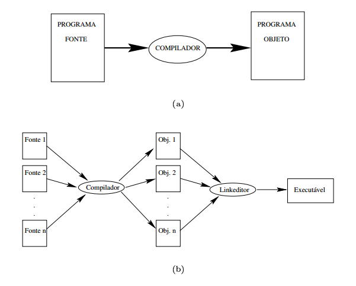

Introdução e visão geral da estrutura de um compilador
======

### INtrudução ao estudo de compiladores

O estudo e escrita de compiladores abrange conceitos de linguagens de programação, arquitetura de máquina, teorias de linguagens de programação, algoritmos e engenharia de software (AHO, 2008).
Nesse documento será aprestado uma introdução ao processo de compilação dando ao aluno uma visão de alto nível da estrutura de um compilador.

### Linguagens de programação

Podemos definir uma linguagem comumente chamada de língua ou idioma como um meio de comunicação entre pessoas. Em programação definimos a linguagem como o meio de comunicação entre o pensamento humano e as ações de um computador (PRICE, 2001). De acordo com AHO(2008) todo o software executado em todos os computadores foi escrito em uma linguagem de programação e antes que ele possa rodar um programa ele deve ser traduzido para um formato que possa ser executado pelo computador.
Os programas executados no computador são sequencias de zeros e uns que representam valores inteiros, ponto flutuante, strings, etc., ou ainda instrução que indicam o que o computador deve fazer. A memória do computador é dividida em partes que possuem endereços únicos, todo o programa armazenado na memória é executado pela CPU que possui registradores que guardam dados temporários utilizados em operações. Pense na seguinte situação: para somar o número armazenado no endereço de memória $000011 com o número armazenado no endereço de memória $000012 é necessário: copiar o conteúdo da memória $000011 para um registrador A; copiar o conteúdo da memória $000012 para um registrado B; somar o conteúdo de A e B e copiar o resultado para o endereço de memória $000013. Esse processo certamente é muito mais complexo do que simplesmente executar o comando c = a + a; Em uma determinada linguagem de programação (DELAMARO, 2004).
Uma linguagem de programação é considera de alto nível quando sua representação está próxima do domínio da aplicação e do problema a ser resolvido. Os computadores por sua vez possuem sua própria linguagem denominada de baixo nível e possuem uma gramática composta por zeros e uns. O processo de tradução de linguagem de alto nível para linguagem de baixo nível é feito através de softwares conhecidos como compiladores ou interpretadores e tem como entrada uma linguagem fonte (alto nível) e como saída uma linguagem objeto (baixo nível) (PRICE, 2001).

Na imagem acima demonstrada por DELAMARO(2004) podemos ver um diagrama que representa o processo de compilação onde a entrada é um programa fonte e a saída é um programa objeto.
De acordo com PRICE (2001) as linguagens de programação podem ser classificadas em 5 gerações:
1ª linguagens de máquina – baixo nível 
2ª linguagens simbólicas ou montagem (Assembly) – baixo nível
3ª linguagens orientadas a usuário – alto nível
4ª linguagens orientadas a aplicação – alto nível 
5 linguagens de conhecimento – alto nível
Nós primórdios da computação os computadores eram programados em linguagem de máquina utilizando notação binaria, dessa forma os algoritmos eram complexos e de difícil implementação. A 2ª geração denominada de linguagens simbólicas ou de montagem foi utilizada para minimizar a complexidade da 1ª geração é utilizavam mnêmicos que substituíam as instruções binárias. As instruções eram convertidas em código de máquina antes de serem executados, esse processo é conhecido como montagem (PRICE, 2001).

As linguagens de 3ª geração são voltadas para a solução de problemas específicos, por exemplo o uso em aplicações comerciais e cientificas, nesse momento surgem linguagens como COBOL, Pascal, Ada, FORTRAN, etc. Essas linguagens são classificas como procedimentais, declarativas, imperativas, logicas, etc. e os programas descrevem como os problemas serão resolvidos através de instruções denominados:
Entrada/saída.
Cálculos aritméticos ou lógicos.
Controle de fluxo.
As linguagens de 3ª geração foram projetadas para serem utilizadas por profissionais específicos conhecidos como engenheiros de software ou simplesmente programadores. Já as linguagens de 4ª geração formam projetadas para serem utilizadas por usuários finais sendo de fácil programação permitindo que os próprios usuários possam resolver os seus problemas, exemplos são: Excel; Access; SQL, etc. As linguagens de 5ª são utilizadas em programas de Inteligência Artificial, simulando comportamentos inteligentes, como exemplo temos o PROLOG (PRICE, 2001).

[^1] Mnemônicos são símbolos que substituem o padrão de bits. Como exemplo o ADD equivale a soma e em bits significa 00100011.

[^2] Desmontador também chamado de Desassemblador faz o processo inverso ao montador, ou seja, pega o código de máquina e transforma em código Assembly. 

Exercicíos
------

1. Explique as diferenças entre um compilador e um interpretador?

2. Quais as cincos classificações das linguagens de programação?
3. Cite os 5 tipos de tradutores e o significado de cada um?
4. Quais as fazes de um processo de compilação?
5. Cite as fazes que pertencem a parte de análise ou front-end do processo de compilação?
6. Cite as fazes que pertence a parte de análise ou back-end do processo de compilação?
7. O que é um integrador puro e um interpretador misto?
8 .O que é a tabela de símbolos e quais os principais atributos que são utilizados?
9. O que é o modelo de compilação Just-In-Time?
