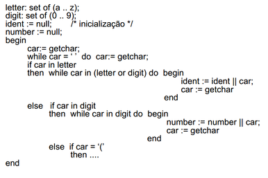

Analise Léxica
======

A análise léxica também conhecida como *scanner* ou leitura é a primeira fase de um processo de compilação e sua função é fazer a leitura do programa fonte, caractere a caractere, agrupar os caracteres em lexemas e produzir uma sequência de símbolos léxicos conhecidos como tokens. 

A sequência de tokens é enviada para ser processada pela analise sintática que é a próxima fase do processo de compilação .

O analisador léxico deve interagir com a tabela de símbolos inserindo informações de alguns tokens, como por exemplo os identificadores. A nível de implementação a analise léxica normalmente é uma sub-rotina da análise sintática formando um único passo, porem ocorre uma divisão conceitual para simplificar a modularizarão do projeto de um compilador.

### Visão geral

A análise léxica pode ser dividida em duas etapas, a primeira chamada de escandimento que é uma simples varredura removendo comentários e espaços em branco, e a segunda etapa, a analise léxica propriamente dita onde o texto é quebrado em lexemas.

Podemos definir três termos relacionados a implementação de um analisador léxico:

* Padrão: é a forma que os lexemas de uma cadeia de caracteres pode assumir. No caso de palavras reservadas é a sequência de caracteres que formam a palavra reservada, no caso de identificadores são os caracteres que formam os nomes das variáveis e funções.

* Lexema: é uma sequência de caracteres reconhecidos por um padrão.

* Token: é um par constituído de um nome é um valor de atributo esse ultimo opcional. O nome de um token é um símbolo que representa a unidade léxica. Por exemplo: palavras reservadas; identificadores; números, etc.

A tabela abaixo mostra os exemplos de uso dos termos durante a análise léxica.

| Token                | Padrão                                              | Lexema                                         | Descrição                        |
|----------------------|-----------------------------------------------------|------------------------------------------------|----------------------------------|
| `<const, >`          | Sequência das palavras c, o, n, s, t                | const                                          | Palavra reservada                |
| `<while, >`          | Sequência das palavras w, h, i, l, e                | while, While, WHILE                            | Palavra reservada                |
| `<if, >`             | Sequência das palavras i, f                         | If, IF, iF, If                                 | Palavra reservada                |
| `<=, >`              | <, >, <=, >=, ==, !=                                | ==, !=                                         |                                  |
| `<numero, 18>`       | Dígitos numéricos                                   | 0.6, 18, 0.009                                 | Constante numérica               |
| `<literal, "Olá">`   | Caracteres entre ""                                 | “Olá Mundo”                                    | Constante literal                |
| `<identificador, 1>` | Nomes de variáveis, funções, parâmetros de funções. | nomeCliente, descricaoProduto, calcularPreco() | Nome de variável, nome de função |
| `<=, >`              | =                                                   | =                                              | Comando de atribuição            |
| `<{, >`              | {, }, [, ]                                          | {, }, [, ]                                     | Delimitadores de início e fim    |

Veja uma série de exemplos relacionados a identificação dos termos.

##### Exemplo 1 

`printf("Total = %d\n", score)`

onde: 

* `printf` e `score` são lexemas que casam com o padrão `identificador`.   

* `Total = %d\n` é um lexema que casa com o padrão `literal`.

* `()` lexemas que auxiliam a identificação de uma função.

##### Exemplo 2

`const PI = 3.1416`

onde:

* `const` casa com o padrão `const` que também é um lexema.  

* `PI` é um lexema que casa com o padrão `identificador`. 

* `=` é um lexema que casa com o padrão do token `atribuição`. 

* `3.1416` é um lexema que casa com o padrão do token `numero`.

Para implementar um analisador léxico é necessário ter uma descrição dos lexemas, então, podemos escrever o código que ira identificar a ocorrência de cada lexema e identificar cada cadeias de carácter casando com o padrão. 

Também podemos utilizar um gerador de analisar léxico que gera automaticamente o algoritmo para reconhecer os lexemas.

Expressões regulares são um mecanismo importante para especificar os padrões de lexemas.

### Tokens

Os tokens são símbolos léxicos reconhecidos através de um padrão.

Os tokens podem ser divididos em dois grupos:

* Tokens simples: São tokens que não tem valor associado pois a classe do token já a descreve. Exemplo: palavras reservadas, operadores, delimitadores - `<if,>`, `<else>`, `<+,>`.

* Tokens com argumento: são tokens que tem valor associado e corresponde a elementos da linguagem definidos pelo programador. Exemplo: identificadores, constantes numéricas - `<id, 3>`, `<numero, 10>`, `<literal, Olá Mundo>` .

Um token possui a seguinte estrutura:

`<nome-token, valor-atributo>`

Onde o nome do token corresponde a uma classificação do token, por exemplo: numero, identificador, const. E o valor do atributo corresponde a um valor qualquer que pode ser atribuído ao token, por exemplo o valor de entrada na tabela de simbolos.

### Exemplo de analise léxica

Suponha que tenhamos o seguinte trecho de código.

```
total = entrada * saida() + 2
```

O seguinte fluxo de tokens é gerado.

`<id, 15> <=, > <id, 20> <*, > <id,30>, <(>, <)> <+, > <numero, 2>`

Temos os seguintes tokens classificados:

* `<id, 15>` :  apontador 15 da tabela de símbolos e classe do token `id`.
* `<=, >`  operador de atribuição, sem necessidade de um valor para o atributo.
* `<id, 20>` : apontador 20 da tabela de símbolos e classe do token `id`.
* `<*, >` :  operador de multiplicação, sem necessidade de um valor para o atributo.
* `<id,30>` : apontador 20 da tabela de símbolos e classe do token `id`.
* `<+, >` :  operador de soma, sem necessidade de um valor para o atributo.
* `<(, >`: Delimitador de função.
* `<), >`: Delimitador de função.
* `<numero, 2>` :  token numero, com valor para o atributo 2 indicado o valor do numero (constante numérica).

A seguir é apresentado alguns exemplos do resultado da análise léxica de um arquivo fonte.

#### Exemplo 1

Código fonte 

```
while indice < 10 do
    indice:= total + índice;
```

Sequência de tokens

`<while,><id,7> <<,><numero,10><do,><id,7><:=,><id,12><+,><id, 7><;, >`

Tabela de símbolos

| Entrada | Informações                 |
|---------|-----------------------------|
| 7       | `indice` - variável inteira |
| 12      | `total` - variável inteira  |


#### Exemplo 2

Código fonte

```
position = initial + rate * 60
```

Sequência de tokens

`<id, 1> <=, > <id, 2> <+, > <id, 3> <*, > <numero, 60>`

Tabela de símbolos

| Entrada | Informações                           |
|---------|---------------------------------------|
| 1       | `position` - variável ponto flutuante |
| 2       | `initial` - variável ponto flutuante  |
| 3       | `rate` - variável ponto flutuante     |

#### Exemplo 3

Código fonte

```
a[index] = 4 + 2
```

Sequência de tokens

`<id, 1> <[,> <id, 2> <],> <=,> <numero, 43> <+,> <numero, 2>`

Tabela de símbolos

| Entrada | Informações                |
|---------|----------------------------|
| 1       | `a` - variável inteira     |
| 2       | `index` - variável inteira |
    

#### Exemplo 4

Suponha que tenhamos a seguinte linha de código.

`position = initial + rate * 60`

Mapeamento de tokens.

| Lexema   | Símbolo | Significado   | Tabela de simbolos | Token         |
|----------|---------|---------------|--------------------|---------------|
| position | ID      | Identificador | 1                  | <Idt, 1>      |
| =        |         |               |                    | <=, simbolo>  |
| initial  | ID      | Identificador | 2                  | <Idt, 2>      |
| +        |         |               |                    | <+, operador> |
| rate     | ID      | Identificador | 3                  | <Idt, 3>      |
| *        |         |               |                    | <*, operador> |
| 60       | Numero  | Inteiro       | 4                  | <Número, 4>   |


Sequência de tokens gerado. 

`<ID, 1> <=> <ID, 2> <+> <ID, 3> <*> <Numero, 4>`

#### Passos para identificar uma sequencia de tokens

A analise léxica divide o código fonte em tokens que posteriormente são classificados de acordo com a classe no qual o token pertence, toda a classe tem uma descrição do que ela representa na linguagem de programação. 

Veja as etapas para contribuir um analisador léxico:

* Reconhecer a substring relacionada ao tokem através de um padrão;
* Partir as strings de entradas em lexemas separando ela do restante dos arquivo fonte;
* Identificar o e classificar o token de cada lexema;

Suponha que temos a seguinte linha de código escrito em linguagem Java:

```
x = 0
while (x < 10) {
    x++;
}
```

A entrada para o analisador léxico é a seguinte:

`x = 0\nwhile (x < 10) {\n\tx++;\n}`

Observe a presença do `\n` e do `\t` que representam respectivamente o carácter nova linha e tabulação.

Com base nesse trecho de código nos podemos concluir que:

* Possui 10 ocorrências de caracteres em branco - incluindo nova, linha, tabulação e espaço em branco;
* Possui 1 ocorrências de palavras reservadas;
* Possui 3 ocorrências de identificadores do identificador `x`;
* Possui 2 ocorrências de números;
* Possui 7 ocorrências outros caracteres - representados por `=`, `(`, `)`, `{`, `}`, `++` e `;`;

O analisador léxico realiza tarefas relativamente simples que basicamente agrupam caracteres para formar as palavras que compõe a linguagem de programação.

### Erros léxicos

A análise léxica é muito prematura para identificar alguns erros de compilação, veja o exemplo abaixo.

`fi (a == “123”) ...`

O analisador léxico não consegue identificar o erro da instrução listada acima, pois ele não consegue identificar que em determinada posição deve ser declarado a palavra reservada `if` ao invés de `fi`. Essa verificação somente é possível ser feita na análise sintática.

Porem é importante ressaltar que o compilador deve continuar o processo de compilação afim de encontrar o maior número de erros possíveis.

Uma situação comum de erro léxico e a presença de caracteres que não pertence a nenhum padrão conhecido da linguagem, como por exemplo o caractere `¢`. Nesse caso o analisador léxico de sinalizar um erro informado a posição desse caractere.

### Expressões regulares

Expressões regulares ou **regex** são uma forma simples e flexível de identificar cadeias de caracteres em palavras. Elas são escritas em uma linguagem formal que pode ser interpretada por um processador de expressão regular que examina o texto e identifica partes que casam com a especificação dada, são muito utilizadas para validar entradas de dados, fazer buscas, e extrair informações de textos. As expressões regulares não validam dados apenas verificam se um texto está em uma determinado padrão.

As expressões regulares são formadas por metacarateres que definem padrões para obter o casamento entre uma **regex** e um texto.

##### Metacaracteres

São caracteres que tem um significado especial na expressão regular.

Abaixo uma tabela dos principais metacarateres.

| Meta  | Descrição                          | Exemplo                                               |
|-------|------------------------------------|-------------------------------------------------------|
| .     | Curinga                            | Qualquer caractere                                    |
| []    | Lista                              | Qualquer caractere incluído no conjunto               |
| [^]   | Lista negada                       | Qualquer caractere não incluído no conjunto           |
| \d    | Dígito                             | O mesmo que [0-9]                                     |
| \D    | Não-digito                         | O mesmo que [^0-9]                                    |
| \s    | Caracteres em branco               |                                                       |
| \S    | Caracteres em diferentes de branco |                                                       |
| \D    | Alfanumérico                       | O mesmo que [a-zA-Z0-9_]                              |
| \W    | Não-alfanumérico                   |                                                       |
| \     | Escape                             | Faz com que o caracteres não sejam avaliados na Regex |
| (...) | Grupo                              | É usado para criar um agrupamento de expressões       |
| &#124; | OU                                | casa &#124; bonita – pode ser casa ou bonita          |

##### Quantificadores 

São tipos de metacaracteres que definem um número permitido de repetições na expressão regular.

| Expressão | Descrição                             | Exemplo                                         |
|-----------|---------------------------------------|-------------------------------------------------|
| {n}       | Exatamente n ocorrências              |                                                 |
| {n,m}     | No mínimo n ocorrências e no máximo m |                                                 |
| {n,}      | No mínimo n ocorrências               |                                                 |
| {,n}      | No máximo n ocorrências               |                                                 |
| ?         | 0 ou 1 ocorrência                     | car?ro – caro ou carro.                         |
| +         | 1,ou mais ocorrência                  | ca*ro –carro, carrro, carrrro, nunca será caro. |
| *         | 0 ou mais ocorrência                  | ca*ro – caro, carro, carro, carrrro             |

##### Casar

Tem o significado de combinar uma expressão regular com texto, é quando os metacaractres especificados na expressão regular correspondem aos caracteres dos textos.

Veja os exemplos:

* A regex `\d,\d` casa com `9,1` já `\d,\d` não casa com `91`.

* A regex `\d{5}-\d{3}` é utilizada pra validar CEP. Essa regex casa com os padrões de texto `89900-000` e `87711-000` mas não casa com os padrões `87711-00077` e `89900000`.  A regex é formada pelo metacaractere `\d` e o quantificador `{5}`

* A regex `[A-Z]{3}\d{4}` é utilizada para validar a placa de um automóvel e casa com o padrão `ACB1234` mas não casa com o padrão `ACB12345`.

As expressões regulares estão diretamente relacionadas a autômatos finitos não determinístico e são uma alternativa amigável para criar notações de NFA.

As **regex** são utilizadas por editores de texto, linguagem de programação, programas utilitários, IDE de desenvolvimento e compiladores e seu padrões são independentes de linguagem de programação.

As expressões regulares dão origem a algoritmos de autômatos finito determinísticos e autômatos finitos não determinísticos que são utilizados por analisadores léxicos para reconhecer os padrões de cadeias de caracteres.

### Geradores de Analisadores Léxicos

Os geradores de analisadores léxicos e automatizam o processo de criação do autômato finito e o processo de reconhecimento de sentenças regulares a partir da especificação de expressões regulares. Essa ferramentas são comumente chamadas de **lex**. Atualmente há diversas implementações de **lex** para diferentes linguagens de programação.

O diagrama abaixo é uma representação de um autômato finito e uma implementação do funcionamento desse autômato.




Embora no exemplo seja simples implementar um analisador léxico, essa tarefa podem ser muito trabalhosa, como essa complexidade é frequente na evolução de uma linguagem de programação surgiriam ferramentas que apoiam esse tipo de desenvolvimento. 

Existem diversas implementações para gerar analisadores léxicos para diferentes linguagens de programação. 

* Flex – http://flex.sourceforge.net/
* JFlex – http://jflex.de/download.html
* Turbo Pascal Lex/Yacc - http://www.musikwissenschaft.uni-mainz.de/~ag/tply/
* Flex++ - http://www.kohsuke.org/flex++bison++/
* CSLex – versão C#, derivada do Jlex - http://www.cybercom.net/~zbrad/DotNet/Lex

A notação ara utilização dessas ferramentas é denominada **linguagem lex**.

O ponto de partida para a criar uma especificação usando a **linguagem lex** é criar uma  especificação de expressões regulares que descrevem os itens
léxicos que são aceitos. 

Este arquivo é composto por até três seções:

* Declarações: Nessa seção se se encontram as declarações de variáveis que representam definições regulares dos lexemas. 

* Regras de Tradução: Nessa seção são vinculada regras que correspondentes a ações em cada expressão regular valida na linguagem.

* Procedimentos Auxiliares: Esta é a terceira e última seção do arquivo de
especificação. Nela são colocadas as definições de procedimentos
necessários para a realização das ações especificadas ou auxiliares ao
analisador léxico

As regras de tradução são expressas no seguinte formato

`Padrão { Ação }`

onde: `Padrão` é uma expressão regular que pode ser reconhecida pelo
analisador léxico `Ação` é um fragmento de código que vai se invocado quando a expressão é reconhecida.

Os geradores de analisadores léxicos geram rotinas para fazer a análise léxica de uma linguagem de programação a partir de um arquivo de especificações contendo basicamente expressões regulares que descrevem os tokens. Essas rotinas representam algoritmos de autômatos finitos - DFA e NFA.

É possível fazer a identificação de cada token através do seu padrão, após esse processo é gerado um arquivo fonte com a implementação do analisador léxico baseado em uma autômato finito que transforma os padrões de entrada em um diagrama de estados de transição.

### Termos

[ˆ1] - Autômato finito: Envolvem estados e as transições entre estados de acordo com a  determinadas entradas.

[ˆ2] - Autômato finito determinístico - DFA: É um autômato finito onde cada símbolo de entrada possui no máximo uma saída, ou seja, para cada entrada existe um estado onde o pode transitar a partir de seu estado atual.

[ˆ3] - Autômato finito não determinístico - NFA: É um autômato finito onde um símbolo de entrada tem duas ou mais saídas, ou seja, pode estar em vários estados ao mesmo tempo, isso possibilita ao algoritmo tentar adivinhar algo sobre a entrada.

[^4] - Expressões regulares - é uma notação - linguagem - utilizada para descrever padrões em cadeias de caracteres quer podem ser representadas por autômatos finitos.