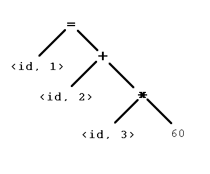
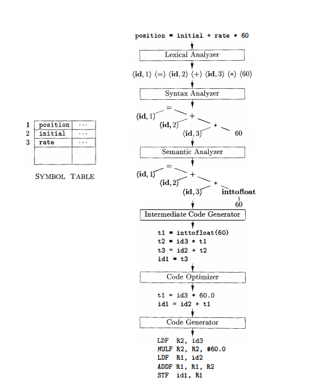
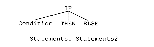
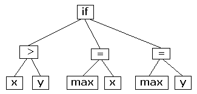

Estrutura de um Compilador
======

Os compiladores operem em uma sequencia de fases, cada uma transformando o programa fonte em uma representação para a etapa seguinte. Nesse capítulo vamos ver de uma forma resumida cada etapa do processo de compilação.

### Analise Léxica

É a primeira fase do processo de compilação, também é conhecida como leitura ou *scanning*. O objetivo nessa fase é identificar unidades léxicas ou lexemas que compõem o programa. O analisador léxico lê todos os caracteres do programa fonte e verifica se eles pertencem ao alfabeto da linguagem, caso não pertença deve ser gerado um erro léxico.

Os comentários e espaços em branco devem ser ignorados e removidos. Esse processo resulta um conjunto de tokens que são formados por palavras reservadas, identificadores, delimitadores, etc. Nessa etapa é criada a tabela de símbolos. De uma forma resumida a análise léxica deve quebrar o texto do programa em lexemas e verificar a categoria ao qual eles pertencem gerando assim os tokens. 

Suponha que tenhamos a seguinte linha de código:

`123 x1 ; Y2 true begin`

O analisador léxico deve identificar 6 lexemas e a categoria de cada um deles.

| Lexema | Categoria                          |
|--------|------------------------------------|
| 123    | Número inteiro                     |
| X1     | Nome de variável                   |
| ;      | Símbolo especial (ponto e vírgula) |
| Y2     | Nome de procedimento               |
| true   | Constante booleana                 |
| begin  | Palavra reservada                  |

Um token pode ser representado da seguinte forma:

`<nome-token, valor-atributo>`

Onde o `nome-token` é um valor abstrato, normalmente o próprio lexema e o `valor-atributo` que na maioria das vezes aponta para um índice na tabela de símbolos ou é omitido.

Suponha que tenhamos a seguinte linha de código.

`position = initial + rate * 60`

Mapeamento de tokens.

| Lexema   | Símbolo | Significado   | Tabela de simbolos | Token         |
|----------|---------|---------------|--------------------|---------------|
| position | ID      | Identificador | 1                  | <Idt, 1>      |
| =        |         |               |                    | <=, simbolo>  |
| initial  | ID      | Identificador | 2                  | <Idt, 2>      |
| +        |         |               |                    | <+, operador> |
| rate     | ID      | Identificador | 3                  | <Idt, 3>      |
| *        |         |               |                    | <*, operador> |
| 60       | Numero  | Inteiro       | 4                  | <Número, 4>   |


Sequência de tokens gerado. 

`<ID, 1> <=> <ID, 2> <+> <ID, 3> <*> <Numero, 4>`

O analisador léxico deve permitir identificar na linguagem repetições de subconjuntos permitindo que seja possível identificar esses subconjuntos. Como exemplo podemos destacar o subconjunto de palavras reservadas. Nessa fase o processamento de uma linguagem pode ser feito por gramáticas regulares podendo ser formalmente descrita por expressões regulares. As rotinas que processam essa linguagem modelam um autómato finito derivado de expressões regulares.

### Analise Sintática

Analise sintática é o coração do compilador e tem como objeto validar a gramática do programa, na análise léxica o objetivo era identificar os lexemas que pertenciam a lingaugem de programação, categorizar esses lexemas e verificar se eles pertencem a linguagem. 

A estrutura gramatical é verificada seguindo as regras da linguagem. É feito uma varredura na sequência de tokens produzidas pelo analisador léxico com o objetivo de construir a árvore sintática, ou árvore de derivação que exibe a estrutura sintática do código. Caso uma construção seja reconhecida com inválida um erro sintético deve ser gerado.

Veja o seguinte trecho de código:

`if (a – 10 > b * 2) a = b;`

O analisador sintático deve ser capaz de analisar essa linha e de reconhecê-la como válida ou inválida. Para isso ele precisa conhecer a estrutura formada palavra reservada `if` a expressão `(` e `)` e o comando de atribuição `a = b`. Após essa validação deve ser montada a árvore sintática dessa linha de código.

A seguinte linha de código:

`position = initial + rate * 60`

Produz esse árvore sintática.



Mesmo com uma boa técnica de detecção de erros o analisador sintático deve recuperá-los e continuar o processo de compilação identificando o maior número possível de erros.

A sintaxe da maioria das linguagens de programação é especificada usando gramáticas livres de contexto que permitem realizar substituições impostas por regras produção e assim validar a estrutura de um programa escrito em uma lingaugem de programação.

### Analise Semântica  

O objetivo dessa etapa é verificar se a semântica do programa fonte tem consistência.  Para isso é utiliza a árvore sintática e as informações da tabela de símbolos. Por exemplo a verificação de tipo em uma operação de soma onde cada operando é verificado com cada operador. 

Outro exemplo é verificar se um índice em um vetor é um número inteiro. Pode ser necessário nessa fase que alguns tipos de dados sejam convertidos para outros tipos, nesse caso ira ocorre a coerção. 

Veja o seguinte exemplo:

`position = initial + rate * 60`

Suponha que a variável `position` seja declarada como inteiro, nesse caso deverá deve ser identificado um erro de tipo interrompendo o processo de compilação. Caso `position`, `initial` e `rate` sejam declarados como ponto flutuante o inteiro `60` deve ser convertido para ponto flutuante. 

Algum tipos de erros semânticos:

* Tipos de operandos incompatíveis com operadores.
* Identificadores,variáveis e procedimento, não declarados.
* Chamada de funções ou métodos com número incorreto de operadores
* Comandos fora de contextos, um comando `continue` fora de um loop.
* Operações de conversão de tipos. 

A tabela de símbolos é muito importante nessa etapa pois é através dela que é possível recuperar informações sobre os identificadores que são utilizadas para avaliar as regras semânticas. 

### Geração de código intermediário

Nesse fase é gerado uma sequência de código denominada código intermediário, que posteriormente em outras fases irá gerar o código objeto. Por ventura essa fase pode não existir e a compilação pode ser feita diretamente para o código objeto. E importante destacar que que o código intermediário não especifica detalhes da construção do código objeto final.

A representação intermediaria deve ser facilmente produzida e facilmente traduzida para a máquina alvo. Uma forma de representação intermediaria muito conhecida e a forma de três endereços que consistem de três operandos por instrução.  Veja o exemplo:

```
T1 = inttofloat(60);
T2 = id3 * t1
T3 = id2 + t2
id1 = t3
```

Essa representação segue o seguinte formato `x = y op z` onde `op` é uma operador binário, `y` e `z` são endereços para os operandos e `x` é o endereço para o resultado.

Uma das vantagens de gerar um código intermediário é a possibilidade de obter um código final mais eficiente através da otimização. A representação intemediária deve representar as operações do programa, esse representação é simples algumas muito semelhantes a *bytecodes* Java.

### Otimização de Código

Nessa fase o objetivo é otimizar o código em termos de velocidade de execução e espaço na memória. Essa etapa não depende da arquitetura de máquina e tem como objetivo fazer transformações no código intermediário afim obter um código objeto mais otimizado. 

Veja um exemplo de código otimizado.

```
T1 = id3 * 60.0
id1 = id2 * t1
```

O número de otimizações irá depender de como o compilador foi implementado, quanto mais otimizações forem realizadas maior o tempo gasto na compilação. Outro detalhe é que a otimização deve reduzir o tempo de execução do programa. Algumas compiladores permitem que seja parametrizado o nível de otimização, como por exemplo o `gcc` através de flags de otimização como `-O2`, `-O3`, etc.

Também existem compiladores que possuem uma etapa chamada de otimização de código dependente de máquina.

### Geração de código objeto

O gerador de código objeto é a última etapa do processo de compilação e recebe como entrada uma representação intermediaria que é mapeia para uma linguagem objeto. Caso a linguagem objeto for a linguagem de máquina de alguma arquitetura especifica deve ser feito a seleção de registradores reserva de memória para as constantes e variáveis. É uma etapa muito importante pois a produção de código objeto eficiente deve ter uma cuidadosa seleção de registradores.

No seguinte trecho de código:

`position = initial + rate * 60`

Uma possível geração de código objeto seria:

```
LDF		R2,		id3
MULF	R2,		R2 #60.0
LDF		R1,		id2
ADDF	R1,		R1, R2		
STF		id1		R1
```

O programa objeto reflete as instruções de baixo nível da plataforma que está sendo utilizada, pode-se fazer necessário um gerador de código para cada plataforma.

Após essa fase concluída para que o programa possa ser executado o código objeto é linkeditado com outros programas objetos ou recursos para posteriormente ser carreado na memória e executado pelo sistema operacional.

### Resultado do processo de compilação.

A imagem abaixo exemplada o processo de compilação divido em etapas. Essas etapas correspondem a estrutura lógica de um compilador e o resultado de cada fase.



### Tabela de símbolos 

Durante toda a fase de compilação algumas informações são armazenadas em uma tabela chamada de tabela de símbolos, que nada mais é do que uma estrura de dodos em forma de lista, dicionário, etc. As informações coletadas nessa tabela dependem do tipo de tradutor desenvolvido e do programa objeto a ser gerado. 

Os seguintes atributos costumam ser gravados na tabela de simbolos:

* Classe dos identificadores: variável, função, etc.
* Tipo de dado: Inteiro, String, etc.
* Tipos de retornos: no caso de métodos
* Variáveis: tipo, endereço no texto, posição e tamanho.
* Parâmetros formais: tipo do mecanismo de passagem - por valor ou referência.
* Procedimentos/sub-rotinas: número de parâmetros.

A tabela de símbolos é utilizado durante todo o processo de compilação a fim de inserir e extrair informações de forma rápida.

### Árvore Sintática

A árvore sintática é uma estrutura de dados em forma de árvore ou grafo que representa estrutura sintática da linguagem de programação.

Veja uma exemplo de uma sentença `if` `else`




Essa representação gráfica é resultante da derivação de uma sentença, cada nó representa uma unidade sintática.

### Termos

[ˆ1] Sintático: tem o sentido de verificação de forma, estrutura sem referência a significado.

[ˆ2] Semântica: tem o sentido de significado.

[ˆ3] Linkeditor ou Linker: é um programa que reúne módulos compilados e arquivos para criar o programa executável.

[ˆ4] Registradores: são áreas no processador que possuem uma grande velocidade e são utilizados para armazenar valores. Existem vários tipos de registradores com finalidade especificas.

### Exercícios
