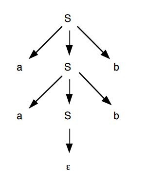
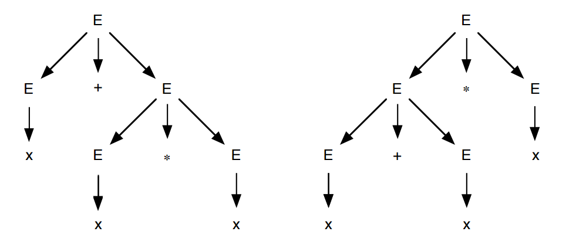
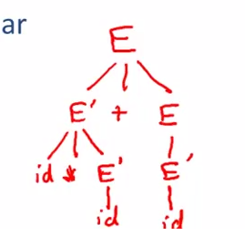
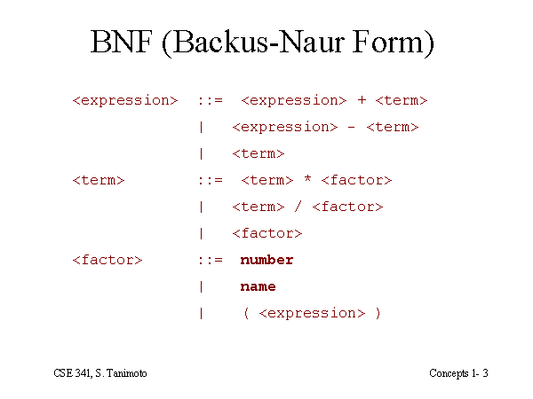
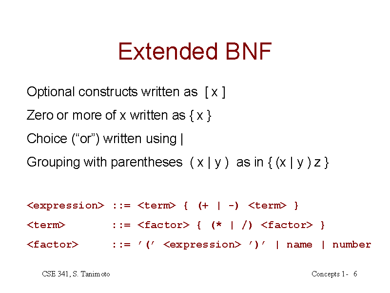
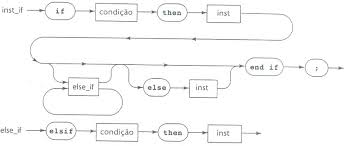

Analise Sintática
======

O Analisador sintático também conhecido como *parser* tem como tarefa principal determinar se o programa de entrada representado pelo fluxo de tokens representa sentenças validas na linguagem de programação 

A analise sintática e a segunda etapa do processo de compilação e na maioria dos casos utiliza gramáticas livres de contexto para especificar a sintaxe de uma linguagem de programação.

### Visão geral

A sintaxe é a parte da gramática que estuda a disposição das palavras na frase e das frases em um discurso. Essa etapa do processo de compilação deve reconhecer a sintaxe do programa fonte e determinar se ele é valido ou não.

Esse modelo pode ser definido utilizando gramáticas livres de contexto que representam uma gramática formal e possuem um o algoritmo que tenta derivar todas as possíveis construções da linguagem.

As derivações tem como objetivo determinar se um fluxo de palavras se encaixa na sintaxe da linguagem de programação.

Alguns termos são utilizados na definição de linguagens de programação.

* **Símbolo**: são os elementos mínimos que compõe uma linguagem. Na linguagem humana são as letras. 
* **Sentença**: É um conjunto ordenado de símbolos que forma uma cadeia ou *string*.  Na linguagem humana são as palavras.
* **Alfabeto**: É um conjunto de símbolos. Na linguagem humana é o conjunto de letras {a, b, c, d, ...} 
* **Linguagem**: É o conjunto de sentenças, Na linguagem humana são os conjuntos de palavras {compiladores, linguagem, ...}
* **Gramática**: É uma forma de representar as regras para formação de uma linguagem.

Trazendo esse conceito para linguagem de programação temos:

* Alfabeto: {w, h, i, l, e, +, 1, 2, 3}
* Símbolos: 1, 5, +, w
* Sentença: while, 123, +1
* Linguagem: {while, 123, +1}

Dada uma gramática `G` e uma sentença `s` o objetivo do analisador sintático é verificar se a sentença `s` pertence a linguagem `G`. O analisador sintático recebe do analisador léxico a sequência de tokens que constitui a sentença `s` e produz uma arvore de derivação se a sentença é válida ou emite um erro se a sentença é inválida. 

O analisador léxico é desenvolvido para reconhecer cadeias de caracteres fazendo uma leitura dos caracteres e obtendo a sequência de tokens, esse analisador vê o texto como uma sequência de palavras de uma linguagem regular e reconhece ele através de autômatos finitos. 

Já o analisador sintático vê o mesmo texto como uma sequência de sentenças que deve satisfazer as regras gramaticais. É através da gramática que podemos validar expressões criadas na linguagem de programação. 


O analisador sintático agrupa os tokens em frases gramaticais usadas pelo compilador com o objetivo de criar uma saída que representa a estrutura hierarquia do programa fonte.

Veja no quadro abaixo a especificação da entrada e saída das etapas vistas até o momento:

| Fase   | Entrada               | Saída              |
|--------|-----------------------|--------------------|
| Lexer  | Conjunto de caracteres | Conjunto de tokens |
| Parser | Conjunto de tokens    | Arvore sintática   |


Observe estrutura sintática de uma linguagem de programação. Temos as divisões dos blocos, compostos por comandos, compostos por expressões.


Entende-se por regras gramáticas as formas como podemos descrever a estrutura sintática do programa. 

No modelo de compilador que está sendo estudado o analisador sintático recebe do analisador léxico uma cadeia de tokens representado o programa fonte verifica se essas cadeias pertencem a linguagem definida pela gramática. Veja um exemplo no diagrama abaixo demostrando esse processo. 


Descubra os erros sintáticos do código fonte abaixo escrito em linguagem Java.


* Na linha 06 a falta do colchete.
* Na linha 03 o ponto e vírgula marcando o final do comando.
* Na linha 01 a virgula separando os parâmetros.

E importante destacar que a árvore de derivação representa toda a estrutura sintática do programa.

### Gramática Livre de Contexto - GLC

As linguagens de programação em geral pertencem a uma categoria chamada de Linguagens Livres de Contexto. Umas das formas de representar essas linguagens é através de Gramáticas Livres de Contexto que são a base para a construção de analisadores sintáticos. Elas são usadas para especificar as regras sintáticas de uma linguagem de programação, uma linguagem regular pode ser reconhecida por uma automato finito, já uma Gramatica Livre de Contexto pode ser reconhecida por um automato de pilha.

Outra aplicação de GLC são os DTD - Definição de Tipos de Documentos -  utilizados por arquivos XML que descreve as tags de uma forma natural, as tags deve estar aninhas afim de lidar com o significado do texto.

Veja o exemplo:

```
<produto><codigo</codigo></produto>
```

Uma gramática descreve naturalmente como é possível fazer construções no programa. Veja o exemplo de um comando `if-else` em Pascal que deve ter a seguinte forma.

`if (expressão) then declaração else declaração ;`

Essa mesma forma em uma Gramática Livre de Contexto pode ser expressada da seguinte maneira: 

`declaração → if ( expressão ) then declaração else declaração ;`

A definição de uma gramática livre de contexto pode ser representada através dos seguintes componentes:

`G = (N, T, P, S)`

Onde: 

* N – Conjunto finito de símbolos não terminais.
* T – Conjunto finito de símbolos terminais.
* P – Conjunto de regras de produções.
* S – Símbolo inicial da gramática.

Terminologias:

* **Símbolos terminais**: Conjunto finito de símbolos básicos que formam as palavras da linguagens, são representadas pelo tokens reconhecidos pelo analisador lexico.

* **Símbolos não terminais**: Conjunto finito de variáveis utilizadas para representar os conjuntos da linguagem, são formadas pelos terminas e pelos próprios símbolos não terminais.

* **Símbolo inicial**: É a variável, simbolo não terminal, que representa o inicio da definição da linguagem. 

* **Regras de produções**: Representa um conjunto de regras sintáticas que representam a definição da linguagem, indicam como símbolos terminais e não terminais podem ser combinados.

As regras de producao são representadas da seguinte forma:

```
    {A} → {α}
```

Onde:

* **A** é uma variável - simbolo não terminal.
* **->** simbolo de producao .
* **α** é a combinação símbolos terminais e não terminais que representam a forma como uma string vai ser formada.

Veja o exemplo de uma Gramatica Livre de Contexto.

```
G = ({S}, {a, b}, P, S)

P = {   
        S → aSb
        S → λ  
    }
```

Essa gramatica é formada pelas terminais `a` e `b`, que são os tokens da linguagem, como regras de produção nos temos `aSb` que indica a presenta de um `a` e `b` nas extremidades da palavras é o simbolo `λ` que significa vazio.

#### Derivacaoes

A derivação é a substituição do conjunto de símbolos não terminais por símbolos terminais começando pelo símbolo inicial, ao final desse processo o resultado é a forma como a linguagem deve assumir.

Durante a derivação devemos aplicar as regras de producao para substituir cada simbolo não terminal por um simbolo terminal, isso permite identificar se certa cadeias de caracteres pertence a linguagem, as regras expandem todas as produções possíveis. Como resultado desse processo nos temos a arvore de derivação.

Tipos de derivação:

* Mais à esquerda: a derivação inicia pela troca do símbolo não terminais mais à esquerda.
* Mais à direita: a derivação inicia pela troca do símbolo não terminais mais à direita.

Independente da direção da derivação, esquerda ou direita, ela deve produzir o mesmo resultado, ou seja, a mesma arvore de derivação, caso o resultado seja diferente temos uma ambiguidade.

#### Árvores de derivação

É uma estrutura em formato de arvores que representa a derivação de uma sentença ou conjunto de sentenças, essa estrutura ira gera a arvores de analise sintática que representa o programa fonte e é o resultado da analise sintática, essa estrutura facilita a a conversão do programa em código objeto.

E importante ressaltar que a arvore de analise sintática esta diretamente relacionada a existência de derivações.

Dada as seguinte GLC:

```
G = ({S}, {a, b}, P, S)

P = {   
        S → aSb
        S → λ  
    }
```

Como resultado temos a seguinte arvore de derivação:



A raiz da arvore de derivação sempre o simbolo inicial, os vértices interiores são os símbolos não terminais, os símbolos terminais e a palavra vazia são as folhas.


#### Ambiguidade:

Certas gramaticas permitem que uma mesma sentença tenha mas de uma arvore de derivação, isso torna a gramática inadequada para a linguagem de programação , pois o compilador não pode determinar a estrutura desse programa fonte e portanto não pode montar o código final, portanto se a derivação mais a esquerda ou a direita produzir maus de uma arvore essa gramatica e dita ambígua.

Uma ambiguidade por ser evitada de duas formas:

1.  Reescrevendo a gramatica afim de remover a ambiguidade, isso pode tornar a gramatica mais complexa.
2. Definir ordens de prioridade na derivação.

Veja um exemplo exemplos comum de gramatica ambiguidades.

Dada a seguinte gramatica utilizada para reconhecer as principais operações aritméticas:

```
G = ({E}, {+, *, (, ), x}, P,  E) 

p { 
    E → E + E
    E → E * E
    E → (E)
    E → x
    E → λ
}
```

Suponha que queremos validar a seguinte sentença `x + x * x`.

• Derivação mais à esquerda
    ∗ E ⇒ E+E ⇒ x+E ⇒ x+E∗E ⇒ x+x∗E ⇒ x+x∗x

• Derivação mais à direita
    ∗ E ⇒ E∗E ⇒ E∗x ⇒ E+E∗x ⇒ E+x∗x ⇒ x+x∗x

Observe que duas arvores sintáticas forma geradas para essa sentença, logo temos uma ambiguidades.



Reescrevendo essa gramatica para evitar a ambiguidade nos temos o seguinte resultado 

```
G = ({E}, {+, *, (, ), x}, P,  E) 

p { 
    E → T + E | T
    T → x * T
    E → x
    E → (E) * T
    E → (T)
    E → λ
}
```

Independente da direção da derivação nos vamos obter a seguinte arvore sintática 



Não existem nenhum algoritmo que seja capaz de eliminar a ambiguidade, e existem gramaticas onde a ambiguidade é impossível se ser eliminada, nesses casos é necessário aplicas a técnicas de eliminação de ambiguidade.

### Forma de Backus-Naur (BNF)

A Forma de Backus-Naur outra maneira de representar linguagens livres de contexto, são muito semelhantes as GLC mas possuem duas importantes diferenças aparacerem quando comparamos com GLC

1. O sinal `→` é substituído por `::=`. Ex: `S → α` ≡ `S ::= α`.
2. Os símbolos não terminais devem esta entre `<` e`>`.

Veja o exemplo



Veja uma comparação entre as duas formas gramaticais

###### Gramatica livre de contexto

``` 
G ({S, M, N}, {x,y}, P, S)
P {
    S → x | M
    M → MN | xy
    N → y
}
```

###### Forma de Backus-Naur

```
G = ({<S>, <M>, <N>}, {x,y}, P, <S>)
<S> ::= x | <M>
<M> ::= <M> <N> | xy
<N> ::= y
```

> Os símbolos <, >, ::= não fazem parte da linguagem


### Forma Estendida de Backus-Naur (BNF)

E um complemento da Forma de Backus-Naur que permite ao lado direto da producao seja possível ter operadores. Isso facilita a escrita das regras gramaticais pois deixa elas mais simples. 

Podemos ter o seguintes operadores:

* Seleção:
    `(α | β)` um dos elementos entre parenteses pode ser expressos

    ```
    <S> ::= a(b | c | d)e
    ```

    Pode assumir as seguintes derivações 
    
    `abe`
    `ace`
    `ade`

* Opcional
    `[α]` o que estiver entre colchetes pode ter utilizado ou não 

    ```
    <S> ::= a[bcd]e
    ```

    Pode assumir as seguintes derivações 

    `ae`
    `abcde`   


* Repetição 0 ou mais vezes

    `(α)*` o que estiver entre parentese pode repetir um numero qualquer de vezes e pode não ser usado

    ```
    <S> ::= a(b)*c
    ```

    Pode assumir as seguintes derivações 

    `ac`
    `abc`   
    `abbc`   
    `abbc`
    `abbb...c`   

* Repetição 1 ou mais vezes

    `(α)+` o que estiver entre parentese pode repetir um numero qualquer de vezes 

    ```
    <S> ::= a(b)+c
    ```

    Pode assumir as seguintes derivações 

    `abc`   
    `abbc`   
    `abbc`
    `abbb...c`   



Outro tipo de notação usual para gramáticas é a notação de grafos sintáticos. Esta notação tem o mesmo poder de expressão de BNF, porém define uma representação visual para as regras de uma gramática livre de contexto.



Na notação de grafos sintáticos, símbolos terminais são representados por círculos e símbolos não-terminais, por retângulos. Setas são utilizadas para indicar a seqüência de expansão de um símbolo não-terminal.

### Exemplos de gramáticas livres de contexto

Nos seção vamos apresentar vários exemplos de GLC, como podemos criar uma GCL, aplicar as regras de derivação e montar a arvore de derivação.

Dicas para criar uma gramática livre de contexto:

* Conhecer todos os tokens;
* Especificar a gramática. Por exemplo `G =  ( {A, B, C}, {int, id, numero, +, -}, P, A )`;
* Criar as regra de produção;
* Fazer a derivação;

> É comum representar os o símbolos terminais em maiúsculo e o não terminais em minusculo.

Na parte 2 desse *ebook* é apresentado o software JFLAP que é utilizado para criar gramaticas e fazer a suas derivações a fim de entender melhor esse conceito.

#### Exemplo 01 – Linguagem ab

Definir a gramática:

```
G = ({S}, {a, b}, P, S)

P { 
    S → aSb 
    S → λ 
}
```

Identificação terminologias

| Descrição               |         |
|-------------------------|---------|
| Símbolos terminais      | a, b    |
| Símbolos não terminais: | S       |
| Símbolo inicial:        | S       |
| Regra de produção:      | P       |

A palavra `aabb` pode ser gerada a partir da seguinte derivação:

```
1 → aSb 
2 → aaSbb 
3 → aabb
```

Com a gramática acima é possível dizer que palavra `aab` pertence linguagem?

#### Exemplo 02 Linguagem ab estendida

Definir da gramática: 

```
G = ({A, B, S}, {a, b}, P, S)
P {
    S → AB
    A → aA
    A → aBB
    B → Bb
    B → b
    A → λ
    B → λ
}
```

Identificação terminologias

| Descrição               |         |
|-------------------------|---------|
| Símbolos terminais      | a, b    |
| Símbolos não terminais: | S, A, B |
| Símbolo inicial:        | S       |
| Regra de produção:      | P       |

A palavra `aabbbb` pode ser gerada a partir da seguinte derivação:

```
1 → AB
2 → aAB
3 → aaBBB
4 → aabBBB
5 → aabbBB
6 → aabbbB
7 → aabbbb
```

Com a gramática acima é possível dizer que palavra `a` pertence linguagem?
E o `b` pertence a linguagem?

#### Exemplo 03 Linguagem ab com restrições

Definir da gramática: 

```
G = ({S, A, B}, {a, b}, P, S)
P {
    S → aaAb
    A → aA
    B → λ
}
```

Identificação terminologias

| Descrição               |         |
|-------------------------|---------|
| Símbolos terminais      | a, b    |
| Símbolos não terminais: | S, A, B |
| Símbolo inicial:        | S       |
| Regra de produção:      | P       |

A palavra `aaab` pode ser gerada a partir da seguinte derivação:

```
1 → aaAb
2 → aaaAb
3 → aaab
```

Com a gramática acima é possível dizer que palavra `abb` pertence linguagem?
E o `aabb` pertence a linguagem?

#### Exemplo 03 Linguagem abc

Definir da gramática: 

```
G = ({S, A, B, C}, {a}, P, S)
P {
    S → aA
    A → aB
    B → aC
    C → λ
}
```

Identificação terminologias

| Descrição               |            | 
|-------------------------|------------|
| Símbolos terminais      | a          |
| Símbolos não terminais: | S, A, B, C |
| Símbolo inicial:        | S          |
| Regra de produção:      | P          |

Olhando para esse gramatica nos podemos concluir que ela somente gerar linguagem formas por `a`

#### Exemplo 04 – Expressões matemáticas

Definir da gramática: 

```
G = ({E, T}, {+, -, *, /,  (, ), x}, P,  E) 

P { 
    E → E + T
    E → E - T 
    E → T
    T → T * F
    T → T / F 
    T → F
    F → (E) 
    F → x
}
```

Identificação terminologias

| Descrição               |                      |
|-------------------------|----------------------|
| Símbolos terminais      | +, -, *, /, (, ), x  |
| Símbolos não terminais: | E, T                 |
| Símbolo inicial:        | E                    |
| Regra de produção:      | P                    |

A expressão `(x + x) * x` pode ser derivada a partir da seguinte regra de produção:

```
1 → T
2 → T * F
3 → F * F
4 → (E) * F
5 → (E + T) * F
6 → (E + T) * F
7 → (T + T) * F
8 → (F + T) * F
9 → (x + T) * F
10 → (x + F) * F
10 → (x + x) * F
11 → (x + x) * x
```

É possível derivar a expressão `x - x?

#### Exemplo 04 – Chamada de funções

Definir a gramática: 

```
G = ({S, X, Y, Z}, {(, ), , , id}, P,  S)   
OPR { 
    S → id(X)
    X → Y
    Y → Y, Z 
    Y → Z
    Z → id
    X → λ
}
```

Identificação terminologias

| Descrição               |                                        |
|-------------------------|----------------------------------------|
| Símbolos terminais      | (,), ,, ,id                            |
| Símbolos não terminais: | S, X, Y, Z                             |
| Símbolo inicial:        | S                                |
| Regra de produção:      | P                                    |

Derivação da sentença `exibir(valor, desconto)`

```
1 → exibir(X)
2 → exibir(Y)
3 → exibir(Y, Z)
4 → exibir(Z, Z)
5 → exibir(valor, Z)
6 → exibir(valor, desconto)
```

Também é possível derivar `print(nome)` e `print()`.

### Geradores de analisadores sintáticos

Da mesma forma que ocorre na construção de analisadores léxicos os analisadores
sintáticos podem ser construídos através de ferramentas que auxiliam esse trabalho.

O funcionamento é semelhante aos analisadores léxicos. Um arquivo com as
especificações sintáticas é criado e através de comandos o analisador sintático é gerado.

A saída é um arquivo de código com a implementação do analisador sintático.

