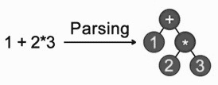
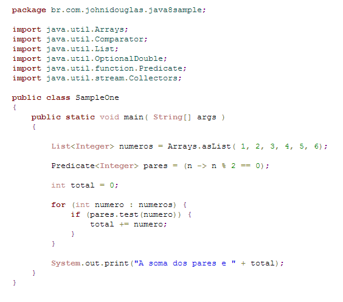
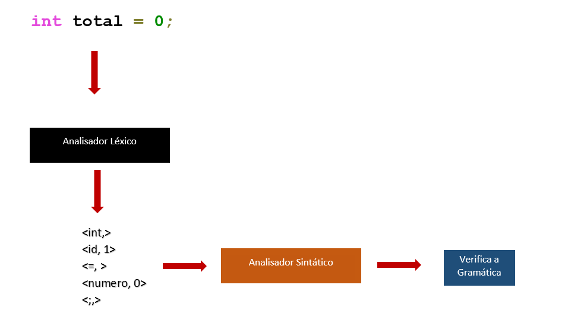
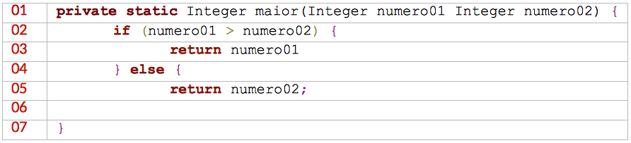

Analise Sintática
======

### Introdução

O Analisador sintático também conhecido como *parser* tem como tarefa principal determinar se o programa de entrada representado pelo fluxo de tokens é uma sentença valida na linguagem de programação 

A analise sintática e a segunda etapa do processo de compilação e utiliza gramáticas livres de contexto para especificar a sintaxe de uma linguagem de programação.

### Visão geral

O que é sintaxe? Parte da gramática que estuda a disposição das palavras na frase e das frases no discurso, bem como a relação lógica das frases entre si.

Essa etapa do processo de compilação deve reconhecer a sintaxe do programa fonte e determinar se ela é valida ou não, esse modele de sintaxe pode ser definido utilizando gramáticas livres de contexto que representa a gramática formal, o algoritmo tenta derivar todas as possíveis construções da linguagem. As derivações tem como objetivo determinar se um fluxo de palavras se encaixa na sintaxe da linguagem de programação.

Alguns termos são utilizados em linguagens de programação para facilitar o seu entendimento.

* **Símbolo**: são os elementos mínimos que compõe uma linguagem. Na linguagem humana são as letras. 
* **Sentença**: É um conjunto ordenado de símbolos que forma uma cadeia ou *string*.  Na linguagem humana são as palavras.
* Alfabeto: É um conjunto de símbolos. Na linguagem humana é o conjunto de letras {a, b, c, d, ...} 
* **Linguagem**: É o conjunto de sentenças, Na linguagem humana são os conjuntos de palavras {compiladores, linguagem, ...}
* **Gramática**: É uma forma de representar as regras para formação de uma linguagem.

Dada uma GLC “G” e uma sentença “s” o objetivo do analisador sintático é verificar se a sentença “s” pertence a linguagem “G”. O analisador sintático também é conhecido como *parser* e recebe do analisador léxico a sequência de tokens que constitui a sentença “s” e produz uma arvore de derivação se a sentença é válida ou emite um erro sintático. 

O analisador sintático deve ser projetado para que a análise seja feita até o fim do programa mesmo que encontre erros no texto do programa fonte.

O analisador léxico é desenvolvido para reconhecer os tokens fazendo uma leitura dos caracteres e obtendo a sequência de tokens, esse analisador vê o texto como uma sequência de palavras de uma linguagem regular e reconhece ele através de um autômato finito. 

Já o analisador sintático vê o mesmo texto como uma sequência de sentenças que deve satisfazer as regras gramaticais. É através da gramática que podemos validar expressões criadas na linguagem de programação. O analisador sintático agrupa os tokens em frases gramaticais usadas pelo compilador com o objetivo de criar uma saída que é uma estrutura de dados que possui uma hierarquia da entrada a árvore de derivação.



Observe estrutura sintática de uma linguagem de programação. Temos as divisões dos blocos, compostos por comandos, compostos por expressões, os tokens.



Entende-se por regras gramáticas as formas como podemos descrever a estrutura sintática do programa. 

No modelo de compilador que está sendo estudado o analisador sintático recebe do analisador léxico uma cadeia de tokens representado o programa fonte verifica se essas cadeias pertencem a linguagem definida pela gramática. Veja um exemplo no diagrama abaixo demostrando esse processo. 



Descubra os erros sintáticos do código fonte abaixo escrito em linguagem Java.



* Na linha 06 a falta do colchete.
* Na linha 03 o ponto e vírgula marcando o final do comando.
* Na linha 01 a virgula separando os parâmetros.

E importante destacar que a árvore de derivação representa toda a estrutura sintática do programa.

### Gramatica Livre de Contexto - GLC

A Gramatica Livre de Contexto ajuda a especificar a sintaxe de uma linguagem de programação. A GLC é a base para a análise sintática das linguagens de programação e permitem descrever a maioria das linguagens de programação usadas atualmente. Uma gramática descreve naturalmente como é possível fazer construções em linguagem de programação. Veja o exemplo de um comando if-else em Pascal que deve ter a seguinte forma.

`if (expressão) then declaração else declaração ;`

Essa mesma forma em uma Gramatica Livre de Contexto pode ser expressada da seguinte maneira 

`declaração → if ( expressão ) then declaração else declaração ;`

As linguagens regulares podem ser reconhecidas através de expressões regulares criando um analisador léxico. Uma linguagem livre de contexto pode ser reconhecida autômatos de pilha que a descrevem a forma como podemos criar analisadores sintáticos.

A definição de uma gramática livre de contexto pode ser representada da seguinte forma:

`G = (N, T, P, S)`

Onde: 

* N – Conjunto finito de símbolos não terminais.
* T – Conjunto finito de símbolos terminais.
* P – Conjunto de regras de produções.
* S – Símbolo inicial da gramática.

Terminologias:

* Símbolos terminais: símbolos básicos que formas as cadeias, são os tokens da linguagem de programação.

* Símbolos não terminais: variáveis sintáticas utilizadas para auxiliar a definição da linguagem, são compostas de símbolos terminas e pelos próprios símbolos não terminais.

* Regras de produções: regras sintáticas que indicam como símbolos terminais e não terminais podem ser combinados.

* Símbolo inicial: Inicio da validação da produção representado por um símbolo não terminal. 

Derivações: É a substituição de cadeias de símbolos terminais iniciando pelo símbolo inicial substituindo os símbolos não terminais pelos símbolos terminais.
Tipos de derivação:
Mais à esquerda: trocamos os símbolos não terminais mais à esquerda.
Mais à direita: trocamos os símbolos não terminais mais a direita.
Exemplos de definição de uma gramática para validar uma linguagem de programação:

### Exemplos de gramáticas livres de contexto

#### Exemplo 01 – Linguagem ab

Definir a gramática: 

```
G = ({LITERAL}, {a, b}, PALAVRA, LITERAL)

PALAVRA { 
	LITERAL → aLITERALb | Ø 
}
```

Identificação terminologias

|                         |         |
|-------------------------|---------|
| Símbolos terminais      | a,e b   |
| Símbolos não terminais: | LITERAL |
| Símbolo inicial:        | LITERAL |
| Regra de produção:      | PALAVRA |

A palavra ``aabb pode ser gerada a partir da seguinte derivação a direita:

```
LITERAL → aLITERALb 
LITERAL → aaLITERALbb 
LITERAL → aaØbb
```

Com a gramática acima é possível dizer que palavra `aab` da linguagem? 

#### Exemplo 02 – expressões matemáticas, soma e multiplicação

Definir da gramática: 

```
G = ({EXP}, {+, *, (, ), x}, OPR,  EXP)	

OPR { 
	EXP → EXP + EXP | EXP * EXP | (EXP) | x
}
```

Identificação terminologias

|                         |                |
|-------------------------|----------------|
| Símbolos terminais      | +,, *, (, ), x |
| Símbolos não terminais: | EXP            |
| Símbolo inicial:        | EXP            |
| Regra de produção:      | PALAVRA        |

A expressão (x + x) * x pode ser derivada a partir da seguinte derivação a esquerda:
```
EXP → EXP * EXP 
EXP → (EXP) * EXP 
EXP → (EXP + EXP) * EXP 
EXP → (x + EXP) * EXP 
EXP → (x + x) * EXP 
EXP → (x + x) * x
```

É possível derivar a expressão x - x?

#### Exemplo 03 – expressões matemáticas completas

Definir da gramática: 

```
G = ({EXP, OP}, {+, *, +, -, (, ), id, numero}, OPR,  EXP)

OPR { 
	EXP → EXP OP EXP | EXP → (EXP) | -EXP | id | numero
	OP → + | - | * | /
}
```

Identificação terminologias

|                         |                                  |
|-------------------------|----------------------------------|
| Símbolos terminais      | + , *, (, ), x, +, -, id, numero |
| Símbolos não terminais: | EXP, OP                          |
| Símbolo inicial:        | EXP                              |
| Regra de produção:      | OPR                              |


Derivação de expressões (Podemos validar qualquer expressão matemática).

Derivação a esquerda da expressão a + b

```
EXP → EXP OP EXP
EXP → EXP OP id
EXP → EXP + id
EXP → id + id

Derivação a direita da expressão -1
```
	EXP → OP EXP
	EXP → OP numero
EXP → - numero

```

#### Exemplo 04 – Chamada de funções

Definir a gramática: 

```
G = ({CHAMADA, CHAMADA_PARAMS, PARAMS, PARAM}, {(, ), , , id}, OPR,  CHAMADA)	
OPR { 
	CHAMADA → id(CHAMADA_PARAMS)
	CHAMADA_PARAMS → (PARAMS | Ø)
	PARAMS → PARAMS, PARAM | PARAM
	PARAM → id
}
```

Identificação terminologias

|                         |                                        |
|-------------------------|----------------------------------------|
| Símbolos terminais      | (,,),,, ,,id                           |
| Símbolos não terminais: | CHAMADA, CHAMADA_PARAMS, PARAMS, PARAM |
| Símbolo inicial:        | CHAMADA                                |
| Regra de produção:      | OPR                                    |

Derivação a esquerda de exibir(valor, desconto)
```
CHAMADA → id(CHAMADA_PARAMS)
CHAMADA → id(PARAMS, PARAM)
CHAMADA → id(PARAM, PARAM)
CHAMADA → id(PARAM, PARAM)
CHAMADA → id(id , id)
CHAMADA → exibir(valor, desconto)
```

Dicas para criar uma gramática livre de contexto

* Conhecer todos os tokens.
* Especificar a gramática. Por exemplo `G =  ( {A, B, C}, {int, id, numero, +, -}, P, A )`
* Criar a regra de produção.
* Fazer a derivação

### Geradores de analisadores sintáticos

Da mesma forma que ocorre na construção de analisadores léxicos os analisadores
sintáticos podem ser construídos através de ferramentas que auxiliam esse trabalho.

O funcionamento é semelhante aos analisadores léxicos. Um arquivo com as
especificações sintáticas é criado e através de comandos o analisador sintático é gerado.

A saída é um arquivo de código com a implementação do analisador sintático.