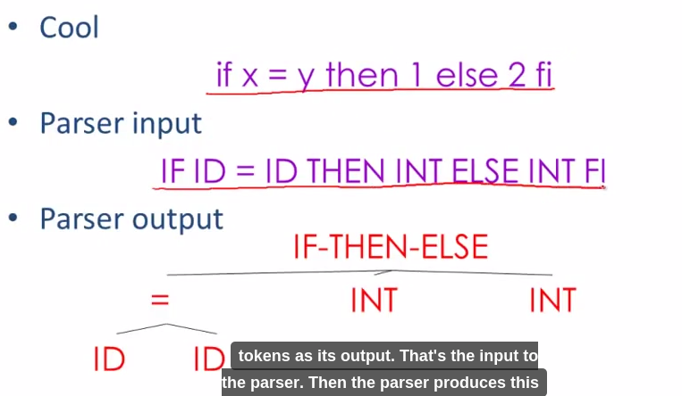

Analise Sintática
======

### Termos utilizados em linguagens de programação.

Alguns termos são utilizados em linguagens de programação para facilitar o seu entendimento.
Símbolo: são os elementos mínimos que compõe uma linguagem. Na linguagem humana são as letras. 
Sentença: É um conjunto ordenado de símbolos que forma uma cadeia ou string.  Na linguagem humana são as palavras.
Alfabeto: É um conjunto de símbolos. Na linguagem humana é o conjunto de letras {a, b, c, d, ...} 
Linguagem: É o conjunto de sentenças, Na linguagem humana são os conjuntos de palavras {compiladores, linguagem, ...}
Gramática: É uma forma de representar as regras para formação de uma linguagem.

### Analise Sintática

O que é sintaxe? Parte da gramática que estuda a disposição das palavras na frase e das frases no discurso, bem como a relação lógica das frases entre si. (AURELIO, 2004).
A análise sintática é a segunda fase do processo de compilação e sua função e verificar se as construções utilizadas no programa estão gramaticalmente corretas. As estruturas sintáticas ou gramaticas podem ser especificadas através das Gramaticas Livres de Contexto – GLC. 
Dada uma GLC “G” e uma sentença “s” o objetivo do analisador sintático é verificar se a sentença “s” pertence a linguagem “G”. O analisador sintático também é conhecido como parser e recebe do analisador léxico a sequência de tokens que constitui a sentença “s” e produz uma arvore de derivação se a sentença é válida ou emite um erro sintático. O analisador sintático deve ser projetado para que a análise seja feita até o fim do programa mesmo que encontre erros no texto do programa fonte.
Existe duas estratégias básicas para a implementação da analisa sintática (as estratégias têm como objetivo tornar o processo de análise sintática mais eficiente):
Top-down ou descendente: constrói a árvore de derivação a partir do símbolo inicial da gramatica fazendo a árvore crescer até as suas folhas. 
Bottom-up ou ascendente: Faz a análise no sentido inverso, ou seja, constrói a árvore de derivação das folhas até o símbolo inicial da gramatica. 
O analisador léxico é desenvolvido para reconhecer os tokens fazendo uma leitura dos caracteres e obtendo a sequência de tokens, esse analisador vê o texto como uma sequência de palavras de uma linguagem regular e reconhece ele através de um autômato finito. Já o analisador sintático vê o mesmo texto como uma sequência de sentenças que deve satisfazer as regras gramaticais. É através da gramatica que podemos validar expressões criadas na linguagem de programação. O analisador sintático agrupa os tokens em frases gramaticais usadas pelo compilador com o objetivo de criar uma saída que é uma estrutura de dados que possui uma hierarquia da entrada a árvore de derivação.

Observe estrutura sintática de uma linguagem de programação. Temos as divisões dos blocos, compostos por comandos, compostos por expressões, os tokens.

Entende-se por regras gramaticas as formas como podemos descrever a estrutura sintática do programa. 
No modelo de compilador que está sendo estudado o analisador sintático recebe do analisador léxico uma cadeia de tokens representado o programa fonte verifica se essas cadeias pertencem a linguagem definida pela gramatica. Veja um exemplo no diagrama abaixo demostrando esse processo. 

Descubra os erros sintáticos do código fonte abaixo escrito em linguagem Java.

* Na linha 06 a falta do colchete.
* Na linha 03 o ponto e vírgula marcando o final do comando.
* Na linha 01 a virgula separando os parâmetros.

### 4. Exercícios 

a) Defina quais são os termos utilizados em linguagens de programação e os seus significados?
b) Qual é o significado de sintaxe?
c) Qual a função da análise sintática?
d) Quais as estratégias para implementar a analise sintática?
e) Explique como o analisador léxico e analisador sintático trabalham juntos? 
f) O que é uma regra gramatical?
g) O que é gramatica livre de contexto?

b) Qual é a forma utilizada para representar uma gramatica livre de contexto.
c) O que é símbolo não terminal, símbolo terminal, regras de produções e símbolo inicial?
d) Explique o que é uma derivação?
e) Faça a derivação a esquerda das seguintes expressões matemáticas utilizando as gramatica definida no item 3.3.

a + 1

(a + b) – 8

c) Crie uma gramática, as regras de produção e a derivação a direta das seguintes instruções.
a. Sistema binário - 0 e 1.

b. Instrução while true ;