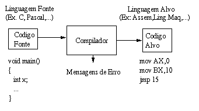

Geração de Código Objeto
======

A geração de código compreende a última fase do modelo de compilador que está sendo estudado, essa etapa recebe como entrada uma representação intermediaria e em conjunto com a tabela de símbolos produz um código equivalente a entrada que será executado por um processador.



A máquina que gera o código não precisa ser necessariamente a máquina que irá executar o código, por exemplo os compiladores que geram código nativo para dispositivos móveis ou software embutidos, porem deve-se elegar uma máquina alvo que ira executar o código gerado.

> Um exemplo de maquina alvo é a JVM, Java Virtual Machine. A utilizacao da JVM permite que varias tarefas da geracao de código como alocacao de registradores, alocacao de moemoria, linkedicao, etc. nao sejam neessarias.


Os principais requisitos para geração de código objeto são os seguintes:

* O código gerado deve ser de alta qualidade;
* O código gerado deve fazer uso efetivos de recursos de máquina;
* O código gerado deve executar eficientemente;

Pelo fato dos compiladores terem que produzir código eficiente devemos destacas a importância da etapa de otimização de código, um dos critérios mais importantes para um gerador de código é que ele produza um código correto e efeciente embora esses criterio sejam atigndispo com tecnicas euristicas.

Formas de produzir um código objeto:

* Linguagem de máquina absoluta: A saída é um código objeto que é alocado e executado diretamente na memória logo após a sua compilação. Compiladores que implementam esse tipo de código são conhecidos com load and go compilers e são utilizados em ambientes acadêmicos.

* Linguagem de máquina realocável: Permite a compilação separada em subprogramas ou módulos, um programa separado faz a ligação dos módulos compilados. Isso permite que a compilação seja feita por módulos realocáveis.

* Linguagem assembly: são geradas instruções simbólicas, para que um montador auxilie a geração do código objeto.


A arquitetura da máquina alvo tem um impacto significativo na construção de geradores de código entre as arquiteturas mais comuns temos a RISC, CISC, e baseadas em pilha.

* RISC (reduced intruction set computer): possui muitos registradores e instruções simples.
* CISC (complex intruction set comulter) : Possui menos registradores e instruções complexas.
* Baseadas em pilha: As operações são feitas colocando os operandos em pilha e efetuando as operações com base no topo da pilha.


#### Tarefa principais da geração de código objeto.


###### Seleção de instruções

O gerador de código precisa mapear as instruções geradas na representação intermediaria para uma sequência de código que a arquitetura alvo possa entender. A complexidade desse processo é determinada por três fatores:

* Nível da representação intermediaria.
* Natureza da arquitetura de instruções.
* Qualidade do código gerado.

A natureza da arquitetura de instruções tem um fator primordial na geração de código pois se a máquina alvo não prover uma instrução para cada tipo de dados podem ocorrer exceções a regra o que exigira tratamentos especiais, outro fator crítico e a velocidade de execução que as instruções oferecem.

Exemplos:

O seguinte código intermediário

```
x := y + z
```

Gera o seguinte código de maquina

```
LD	R0, 	y	// carrega y ao registrador R0
ADD	R0, R0, z	// soma z a R0 (R0 = R0 + 0 )
ST	x, R0		// armazena R0 em x ( x = R0 )
```

Na maioria das máquinas uma sequência de código intermediário pode ser gerar diversas formas de código objeto.

Exemplo: Nesse caso uma família de processadores pode possuir o registrador chamado `INC` que faz o incremento de um valor, porem outros processadores podem não ter esse registrador, nesse caso temos uma exceção que deve ser tratada pelo gerador de código.

Veja uma gera'cao de codigo para dois tipos deiferntes de arquitetura

Código intermediário
```
a := a + 1
```

Processador família x45
```
INC a, #1
```

Processador família 8455

```
LD	R0, 	a	
ADD	R0, R0, #1	
ST	a, R0
```

Essas informações de arquitetura devem estar disponíveis para que o algoritmo de geração de código tenha condições de efetuar a escolha correta de instrução para obter um melhor resultado.

##### Alocação de registradores

Outro desafio na geração de código é a correta seleção dos valores que irão residir nos registradores. O registrador é uma área dos processadores que armazém valores e permitem realizador operações de forma rápida, os valores utilizados pelos registradores devem residir na memória do computador. A alocação e atribuição de registradores ocorre com seleção de um registrador especifico para qual uma variável será armazenada.


##### Ordem de avaliação

Trata-se da ordem em que as operações são efetuadas, a correta avaliação das dependências, manter resultados intermediários e execução de várias operações ao mesmo tempo.


#### Montadores

Em muitos casos o resultado do processo de compilação é um arquivo contendo um programa em assembly correspondente ao programa de alto nível. Esse programa em linguagem assembly, ou linguagem simbólica, possui todas as instruções de máquina para gerar o programa executável na arquitetura alvo. O montador (assembler) é o programa do responsável por traduzir o código assembly em linguagem de máquina, traduzindo cada instrução do programa para a sequência de bits que codifica a instrução de máquina. Como cada processador tem sua própria linguagem, montadores são específicos para processadores.  O processo de montagem recebe como entrada um arquivo texto com o código fonte do programa em assembly e gera como saída um arquivo binário, o módulo objeto, contendo o código de máquina e outras informações relevantes para a execução do código gerado. 


#### Carregadores e Ligadores

Os montadores geram um arquivo de conteúdo binário, contendo o código objeto associado ao arquivo-fonte de entrada. O arquivo com o código objeto contém parte da informação necessária à sua execução, para que ocorra a execução é preciso que esse código seja transferido para a memória principal. Se, ainda, o código faz referências a elementos (dados ou rotinas) externas, será preciso integrar essas referências ao código executável. A ligação, que resolve as referências que tenham sido feitas a dados e rotinas em outros programas, e o carregamento, que transfere o programa montado para a memória principal e dá início à sua execução.

O formato do módulo objeto ou arquivo executável conte as seguintes informações.


* Cabeçalho: contém a identificação do tipo de arquivo e dados sobre o tamanho do código e eventualmente o arquivo que deu origem ao arquivo objeto;


* Código gerado: contém as instruções e dados em formato binário, apropriado ao carregamento;


* Relocação: contém as posições no código onde deverá ocorrer mudanças de conteúdo quando for definida a posição de carregamento;


* Símbolos: contém os símbolos globais definidos no módulo e símbolos cujas definições virão de outros módulos;


* Depuração: contém referências para o código fonte, tais como o número de linha, nomes originais dos símbolos locais e estruturas de dados definidas.


http://cs.nyu.edu/courses/fall15/CSCI-GA.2130-001/lectures/lecture-9.pdf


Exercícios.


	Qual a principal tarefa executada na etapa de geração de código?


	Quais os principais requisitos da etapa de geração de código?


	Cite as três principais tarefas executadas na geração de código e explique o que cada tarefa executa?


	Cite as formas utilizada para produz código objeto?


	O que é um Montador?


	O que é um Carregador?


	O que é um Ligador?

