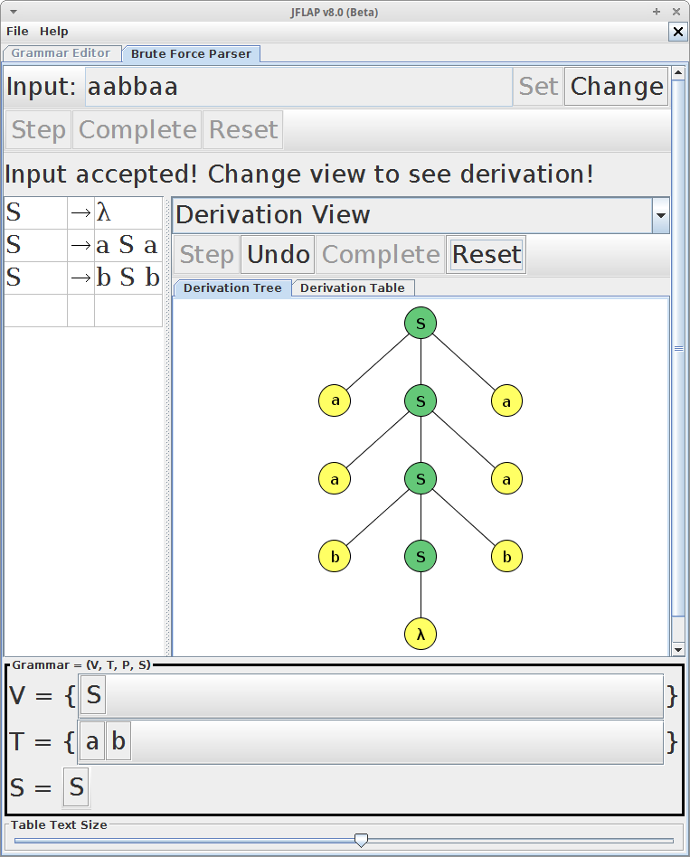

Criando Gramáticas Livres de Contexto com o JFlap
======

O JFLAP - Java Formal Languages & Automata Package - é uma ferramenta que utiliza recursos visuais para aprender conteitos basicos de Lingaugems Formais e Automatos Finitos

Com o JFLAP deve ser capaz diversas variações de autômatos finitos, máquinas de Turing, expressões regulares (REX) escrever montar uma arvore de derivação de uma livre de contexto gramática (CFG) entreo outros assuntos.

Para er mais detalhes de quais recusrsos existe no FJALP e de como usar acesse o tutotial oficial dispivel em http://www.jflap.org/tutorial/

O JFLAP é um projeto escrito em Java, portanteo voce precisar ter o Java instalado para executar esse aplicativo.
http://www.jflap.org/
 
> A ultima versão dispnivel o JFLAP é a 8, nesse exemplos etaremos utilziando essa versao.

Neste tópico nos vamos abordado como podemos utilizar o JFLAP para auxiliar-nos na construção de gramáticas e verificar a arvore de derivaoca gerar por determinada gramatica. nos podmeos terar a gramática e ver se ela está funcionando corretamente ou não

Nossa proxima estapa  demostrar como podemos usar o JFLAP com gramaticas. 

Ao abriro o JFLAP a seguinte tela é exibida.


Observe que temos um menu com varias opcçoes, o nos inteessa é a *GRammar*. Clique nesse opçao, uma tela pareciudo com essa ira ser aberto. Essa vai ser a nossa tela de trabalho.


Digite a seguinte gramatica `G = ({S}, {a, b}, P, S), com as seguintes regras de produção no JFLAP.

```
S → aSa
S → bSb
S → λ
```

Veja como ficou o resultado dessa gramatica no JFLAP


Nosso objetivo e verificar se as sentenças `aabbaa` e `aabb` são validas.

Acesse o menu `Input -> Brute Force Parser`, aseguinte tela ira abrir  


Com ela nos podemos realziar os testes e verificar a validade de uma serntencça

No campo *Input* digite a seguitne sentença `aabb` e clique no botão *Set* depois cliquie no botão *Complet*. Observe que uma mensagem informado que a sentaçã é invalida foi exibida


Isso porque a setneçca `aabb` não é valdia para a gramatica desse ecxemplo

Cliuqe no bottao *Change* e inclua a seguitne sentença `aabbaa`. NOvamente clique no botão *Set* depois cliquie no botão *Complet*. Como essa sentença é valida o resultado foi o seguine:


UM recurso muito interessante do JFLAP é o *Derivation View* que mostra a arevore de derivacao.



Observe que voce pode utilizar o botoes *Step*, *Undo*, *Reset* e *Complete* para acompnhar o resultado da gramatica.

Nas etapas seguitnes nos vamos utiliar variaos exemplo de gramaticas em seguiencia, para melhor entender esse conteito. Voce pode inserser essa gramatica no JFLAP e verificar o resuldado de cada uma.

#### Exemplo 01 - Linguagem formado por parenteses

Espsecificacao da grmatica

```  
S → SS
S → (S)
S → ()
S → λ
```

Sentenças

|         |           |
|---------|-----------|
| ()()    | Valida    |
| ()())   | Inválida  |
| (())()  | Valida    |

#### Exemplo 02 - Linguagem formado por parenteses e colches

Espsecificacao da grmatica

S → SS
S → ()
S → (S)
S → []
S → [S]
S → λ

Sentenças

|            |           |
|------------|-----------|
| ()         | Valida    |
| []         | Valida  |
| [()()]     | Valida  |
| [([()])]   | Valida  |
| [(])       | Inválida  |
| [(([[]]))] | Valida  |


#### Exemplo 03 - Lingaugem formada por pares de  letras

```  
S → aSb
S → ab
S → λ
```

Sentenças

|   |   |
|---|---|
| ab   | Valida  |
| abab   | Inválida  |
| aaabbb   | Valida  |

#### Exemplo 04 - Lingaugem formada por uma combinacao de letras dispostos

```
S → SaSc
S → bSc
S → SaS
S → Sb
S → bS
S → λ
```

ac, aac, bbc, aaac, bbbc, aaaac, bbbbc

|   |   |
|---|---|
| ac   | Valida  |
| aac   | Valida  |
| aaac   | Valida  |
| bbbbc   | Valida  |
| acd   | Inválida  |
| aaaaa   | Valida  |

#### Exemplo 04 - Lingaugem para operacoes de soma e multiplicacao 

Vt = { x , + , * , ( , ) } 
Vn = { S, A }

S → x
S → xAx
S → (S)
A → +
A → *

|   |   |
|---|---|
| x+x   | Valida  |
| x*x   | Valida  |
| x-x   | Inválida  |
| +x   | Inválida  |


O JFLAP é um software muito completo, voce utilzar ele para validar gramaticas mais complexas 
