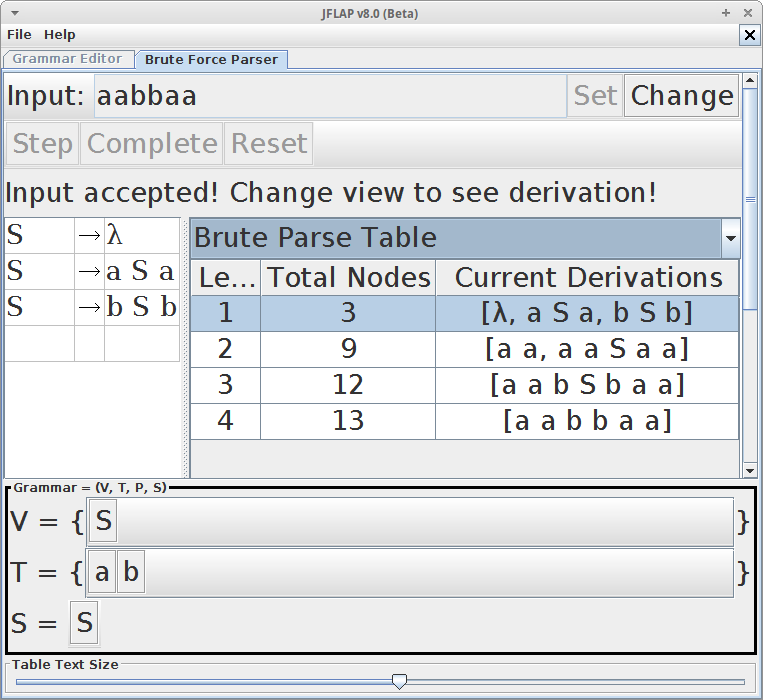

Criando Gramáticas Livres de Contexto com o JFlap
======

O JFLAP, Java Formal Languages & Automata Package, é uma ferramenta que utiliza recursos visuais para demonstrar conceitos básicos de Linguagens Formais e Autômatos Finitos.

Com o JFLAP é possível representar diversas variações de autômatos finitos, máquinas de Turing, expressões regulares (REX), escrever e montar árvores de derivação de gramáticas livres de contexto entre outros assuntos relacionados ao estuado de Linguagens Formais e Autômatos Finitos.

Para mais detalhes dos recursos e de como usar o JFALP acesse o tutorial oficial disponível em http://www.jflap.org/tutorial/.

O JFLAP é um projeto escrito em Java, portanto você precisar ter o Java instalado para executar esse aplicativo.
 
> A ultima versão dispensável o JFLAP é a 8, nos exemplos abaixo vamos utilizar essa versão.

Neste tópico vamos abordar como podemos utilizar o JFLAP para construir gramáticas e verificar a arvore de derivação gerada por determinada gramatica. Nós podemos verificar se a gramática esta de acordo com uma determinada sentença.

Ao abrir o JFLAP a seguinte tela é exibida.


Observe que temos um menu com varias opções, oque nos interessa nesse momento é o menu *Grammar*. Clicando nessa opção, a seguinte tela sera averta, esse vai ser nosso ambiente de trabalho.


Data a seguinte gramatica `G = ({S}, {a, b}, P, S), inclua as seguintes regras de produção no JFLAP.

```
S → aSa
S → bSb
S → λ
```

Veja como ficou o resultado dessa gramatica no JFLAP.


Nosso objetivo e verificar se as sentenças `aabbaa` e `aabb` são validas.

Acesse o menu `Input -> Brute Force Parser`, a seguinte tela ira abrir.


Com ela nos podemos realizar os testes e verificar a validade de uma sentença.

No campo *Input* digite a seguinte sentença `aabb`, clique no botão *Set* depois clique no botão *Complet*. Observe que uma mensagem aparece informado se a sentença é invalida ou invalida.


Observe que a sentença `aabb` não é valida para a gramatica desse exemplo.

Clique no botão *Change* e inclua a seguinte sentença `aabbaa`. Novamente clique no botão *Set* depois clique no botão *Complet*. Como essa sentença é valida o resultado foi o seguinte:



Um recurso muito interessante do JFLAP é o *Derivation View* que mostra a árvore de derivação de determinada sentença.


Observe que você pode utilizar o botoes *Step*, *Undo*, *Reset* e *Complete* para acompanhar o resultado da derivação da gramatica.

Nas etapas seguintes nos vamos utilizar vários exemplos de gramaticas em sequencia, para melhor entender esse conceito. Você pode fazer os testes das gramaticas no JFLAP, verificar o resultado de cada uma, e acompanhar a derivação.

#### Exemplo 01 - Linguagem formado por parenteses

Especificação das regras de produção

```  
S → SS
S → (S)
S → ()
S → λ
```

Sentenças


* `()()` - Válida
* `()())` - Inválida
* `(())()` - Válida

#### Exemplo 02 - Linguagem formado por parenteses e colchetes

Especificação das regras de produção

S → SS
S → ()
S → (S)
S → []
S → [S]
S → λ

Sentenças


* `()` - Válida
* `[]` - Válida
* `[()()]` - Válida
* `[([()])]` - Válida
* `[(])` -  Inválida
* `[(([[]]))]` - Válida


#### Exemplo 03 - Linguagem formada por pares de  letras

Especificação das regras de produção

```  
S → aSb
S → ab
S → λ
```

Sentenças

* `ab` -Válida
* `abab` - Inválida
* `aaabbb` - Valida

#### Exemplo 04 - Linguagem formada por uma combinação de letras

Especificação das regras de produção

```
S → SaSc
S → bSc
S → SaS
S → Sb
S → bS
S → λ
```

* `ac` - Válida
* `aac` - Válida
* `aaac` - Válida
* `bbbbc` - Válida
* `acd` - Inválida
* `aaaaa` - Válida

#### Exemplo 04 - Linguagem para operações de soma e multiplicação 

Especificação das regras de produção

S → x
S → xAx
S → (S)
A → +
A → *


*  `x+x` - Válida
*  `x*x` - Valida
*  `x-x` - Inválida
* `+x` - Inválida


O JFLAP é um software completo, você utilizar ele para validar gramáticas mais complexas.
