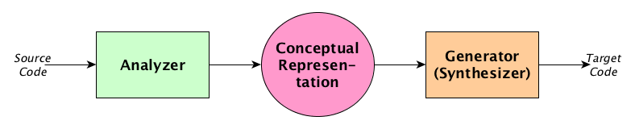

Arquitetura de Compiladores - Ray Toal 
======

## Conteúdo original

Original http://cs.lmu.edu/~ray/notes/compilerarchitecture/

## Tradução

Compiladores são programas geralmente grandes e complexos. Eles quase sempre tem uma estrutura baseada no modelo de tradução conhecido como analise e síntese.

### Visão Geral

Compiladores realizam traduções significativas que requerem etapas de análise e síntese.

Ambas as etapas de análise e síntese são formadas por fases internas.

### Componentes de um compilador

Esses são os principais componentes funcionais de um compilador que gera código Assembly ou código em linguagem de máquina, se você está apenas gerando uma linguagem de alto nível como C, ou código para uma máquina virtual, algumas dessas etapas podem ser omitidas:

Você também pode ter um sistema de recuperação de erros e gerenciar uma tabela de símbolos.

### Analise Léxica (Scanner)

O *scanner* converte o código do programa-fonte e um fluxo de tokens, removendo espaços em branco e comentários.

Veja o exemplo em C:

Esse código gera o seguinte fluxo de tokens:

*Scanners* estão preocupados com questões como:

* Case sensitive or insensitive.
* Se espaços em branco são significativas.
* Se espaços novas linhas são significativas.
* Se comentários pode ser aninhados.

Erros que podem ocorrer durante a análise léxica são chamados de erros léxicos e incluem:

* Caracteres que não estão definidos no alfabeto da linguagem.
* Muitos caracteres em uma palavra ou linha, algumas linguagens podem ter essa limitação.
* Caracteres "unclosed" em strings e comentários.
* Um indicador de final de arquivo em um comentário

### Analise Sintática (Parser)

O parser transforma a sequência de *tokens* em uma árvore sintática abstrata. Para o exemplo do código escrito em C nós temos a seguinte árvore:

A árvore também pode ser gerada no forma de string

Ou, cada nó da árvore pode armazenado como um objeto com campos e nome. Observe que nessa etapa da compilação a árvore definitivamente é apenas uma árvore. Não há ciclos.

Quando construirmos um parser, é necessário se preocupar com a complexidade gramatical, por exemplo, se a gramática é LL ou LR e se existem regras ambíguas. Algumas linguagens necessitam de umas algum tipo de análise semântica na fase de *parser*.

> Exercício: Mostre que a expressão `(x)-y` em C pode ter duas diferentes interpretações sintáticas. 
Dica: a sua resposta provavelmente vai ter as palavras "subtraction", "typedef", "cast", e "negation".

Erros queocorrem durante a análise sintática são chamados de erros sintáticos, em C são coisas como:

* `j = 4 * (6 − x;`
* `i = /5`
* `42 = x * 3`

### Analise Semântica

Durante a análise semântica temos que verificar a validade das regras semânticas, ao fazer isso, nos amaramos pedações de código na árvore sintática para resolver referencia de identificadores, operadores de conversão, etc, isso forma um gráfico semântico.

O conjunto de regras semânticas é diferente para cada linguagem de programação. Exemplo de regras semânticas podem ser vistas na lista abaixo para a linguagem Java:

* Várias declarações de uma variável dentro de um escopo.
* Referência de uma variável antes dela ser declarada.
* Referência a um identificador que não tem declaração.
* Violação de regras de acesso - public, private, protected.
* Muitos argumentos em uma chamada de método.
* Argumentos insuficientes em uma chamada de método.
* Tipos incongruentes

Erros que ocorrem durante essa fase são chamados de **erros semânticos**

> Exercício: A linguagem Pascal tem uma sintaxe não usual quando se trata de expressões: dado o operador `end`, que requer operadores booleanos, que tem precedência maior que os operadores relacionais. Mostre como isso gera um erro sintático na expressão `x-4<=5 and 2<y`.

### Geração de código intermediário

A geração de código intermediário produz um gráfico de fluxo composto por um bloco de declarações. Para o exemplo de código em C temos:

### Otimização de código independente de máquina

Otimizações de código normalmente são feitas com base no gráfico semântico ou no código intermediário, Na pártica existem inúmeras otimização e melhorias conhecias, mas nenhuma é aplicada durante a execução do código.

### Geração de código

A geração de código produz o códio destino, ou algo muito próximo a isso. Compiladores tradicionais geram código para arquiteturas RISC, o código gerado nesse fase é a linguagem Assembly que assume a forma de um grande conjunto de registradores. Para arquitetura CISC isso  depender de cada caso.

Veja o exemplo de código gerado pelo gcc 4.2.1 do nosso exemplo em C para uma arquitetura X86 no Mac OSX 10.6

### Otimização de código dependente de máquina

Geralmente essa é a fase final de um processo de compilação que limpa e melhora o código destino. Com base no exemplo de código em C escrito acima, nós temos esse código destino, definindo durante a compilação o nível `-06`  de otimização no **gcc**

